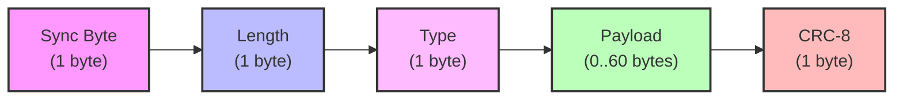
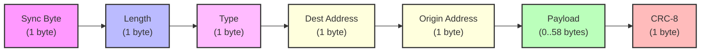
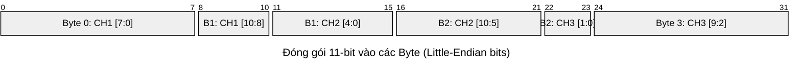
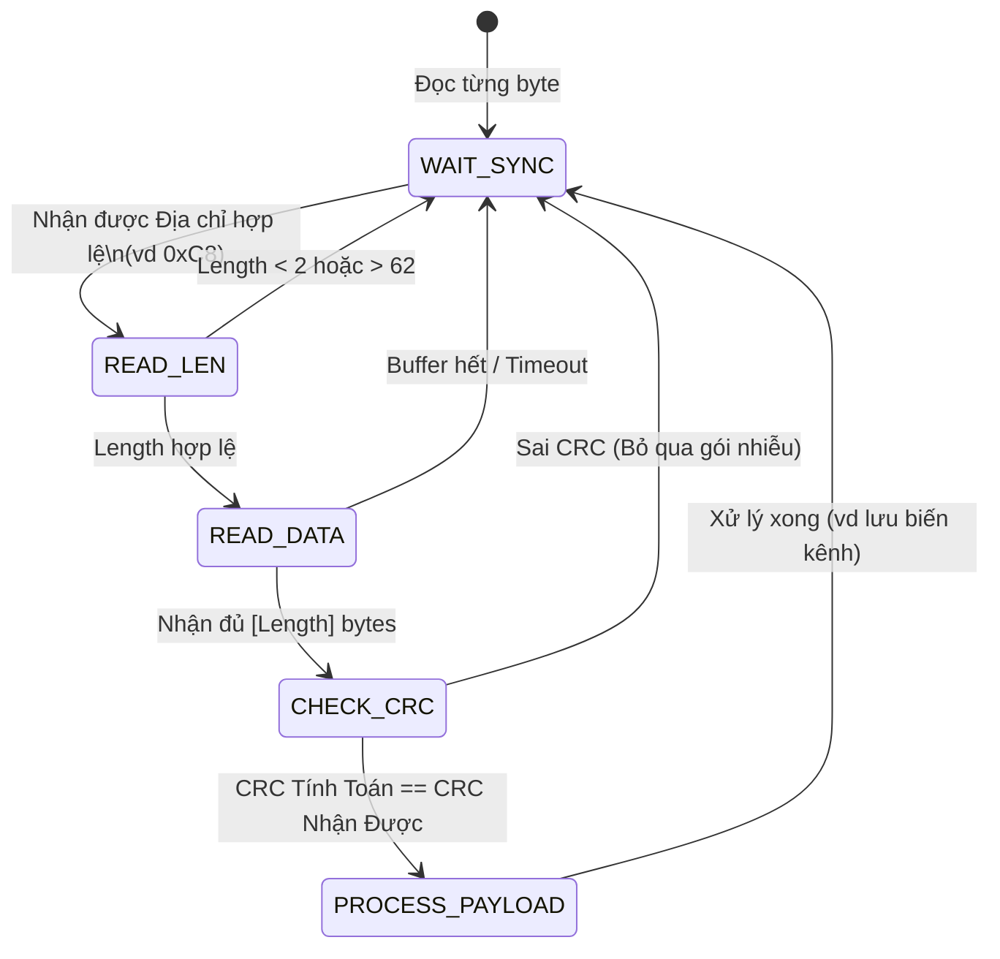

# Cấu trúc Khung truyền (Frame Format) của giao thức CRSF

Tài liệu này giải thích chi tiết về cấu trúc của một gói tin (frame) trong giao thức Crossfire Serial Protocol (CRSF). Giao thức này được thiết kế để truyền tải dữ liệu với độ trễ thấp, tốc độ cao (thường ở baudrate 416666 hoặc 420000 bps) giữa bộ thu (Receiver) và Flight Controller (FC).

Tất cả các gói tin CRSF đều có chiều dài tối đa là **64 byte** và tuân theo định dạng chuẩn (Big-endian cho dữ liệu lớn hơn 1 byte, ngoại trừ một số bit-packed data).

---

## 1. Cấu trúc tổng quát của một Frame

Có hai loại cấu trúc chính trong CRSF: **Broadcast Frame** (Gói tin quảng bá, Header ngắn) và **Extended Header Frame** (Gói tin có header mở rộng, hỗ trợ định tuyến). Các gói tin có `Type` < `0x27` thường dùng Broadcast Frame.

### 1.1 Broadcast Frame (Thường dùng cho RC Channels, Telemetry cơ bản)

*Công thức tính Length:* `Length = sizeof(Type) + sizeof(Payload) + sizeof(CRC-8)`

---

### 1.2 Extended Header Frame (Dùng để gửi thông số, lệnh cấu hình)

---

## 2. Phân tích chi tiết các trường (Fields)

### 2.1 Sync Byte (Địa chỉ thiết bị nhận/Đồng bộ)
Là byte đầu tiên của gói tin. Nó có thể là địa chỉ thiết bị (Device Address) của thiết bị đang nhận hoặc là địa chỉ quảng bá. Các giá trị phổ biến:
- `0xC8` : Flight Controller (Phổ biến nhất khi FC nhận tín hiệu điều khiển)
- `0xEA` : Radio Transmitter (Tay điều khiển)
- `0xEC` : CRSF Receiver (Bộ thu tín hiệu RF)
- `0xEE` : CRSF Transmitter Module (Module phát sau tay điều khiển)
- `0x00` : Broadcast (Phát tới tất cả)

### 2.2 Frame Length (Độ dài gói)
Cho biết số lượng byte tiếp theo của gói tin (KHÔNG bao gồm Sync Byte và chính byte Length).
- Giá trị tối thiểu: `2` (Type + CRC)
- Giá trị tối đa: `62` (Vì tổng gói tin lớn nhất là 64 byte)

### 2.3 Frame Type (Loại gói tin)
Định nghĩa nội dung của phần Payload. Dưới đây là các loại quan trọng đối với FC/Lighting Controller:
- `0x16` (22) : **RC Channels Packed Payload** (Dữ liệu 16 kênh điều khiển).
- `0x14` (20) : **Link Statistics** (Thông số chất lượng sóng, RSSI, SNR).
- `0x08` (08) : **Battery Sensor** (Dữ liệu pin: V, A, mAh).
- `0x1E` (30) : **Attitude** (Góc nghiêng: Pitch, Roll, Yaw).
- `0x21` (33) : **Flight Mode** (Tên chế độ bay dưới dạng chuỗi text).

### 2.4 Payload (Dữ liệu chính)
Nội dung phụ thuộc vào `Type`.

**Ví dụ: Payload của RC Channels (Type `0x16`)**
Gói này mang giá trị của 16 kênh điều khiển. Mỗi kênh chiếm đúng **11 bit** (có giá trị từ 172 đến 1811, điểm giữa là 992).
16 kênh x 11 bit = 176 bit = **22 byte**.

Sơ đồ nén dữ liệu (Bit-packing) của 3 kênh đầu tiên:

*(Trong C, việc trích xuất được thực hiện bằng cách dùng toán tử dịch bit `>>` và `<<` kết hợp mask `& 0x07FF`)*

### 2.5 CRC-8 (Mã kiểm tra lỗi)
Dùng để xác thực tính toàn vẹn của dữ liệu.
- Đa thức (Polynomial): `0xD5` (x⁷+x⁶+x⁴+x²+x⁰)
- Giá trị khởi tạo: `0x00`
- **Quan trọng:** CRC chỉ được tính toán trên đoạn `[Type] + [Payload]`. Hai byte đầu tiên (`Sync Byte` và `Length`) KHÔNG được đưa vào tính CRC.

---

## 3. Quá trình xử lý (Phân tích gói tin - Parsing) trong phần mềm

Khi luồng byte liên tục (stream) được đẩy vào từ UART/DMA, trình phân tích (Parser) trong chương trình STM32 sẽ hoạt động theo logic sau:

### Tại sao CRC lại quan trọng ở tốc độ cao?
Với tốc độ 420,000 baud trong môi trường RC (nhiều nhiễu điện từ từ motor/ESC), một vài bit bị lật (bit-flip) là điều bình thường. Nhờ có CRC-8, chúng ta có thể loại bỏ ngay lập tức những khung truyền bị hỏng, đảm bảo Servo và Đèn chiếu sáng không bị giật (glitch) hoặc chớp nháy loạn xạ vì nhận nhầm giá trị rác.
