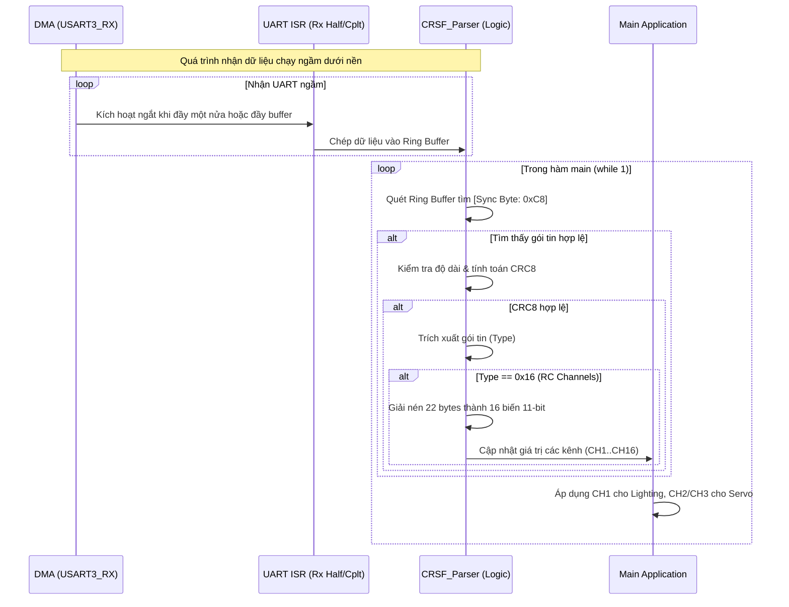

# Kế hoạch tích hợp giao thức CRSF qua UART3

Tài liệu này mô tả chi tiết các bước cần thực hiện, cấu hình phần cứng (thông qua STM32CubeMX) và kiến trúc phần mềm để bổ sung khả năng nhận tín hiệu điều khiển từ bộ thu (Receiver) sử dụng giao thức **TBS CRSF** thông qua cổng **USART3**.

## 1. Tổng quan hệ thống (System Overview)

Hiện tại, hệ thống sử dụng **TIM2 Input Capture** để đọc trực tiếp xung PWM từ các bộ thu RC truyền thống (PWM). Việc nâng cấp để hỗ trợ **CRSF** mang lại nhiều lợi ích:
- **Độ trễ thấp & Tốc độ cập nhật cao:** CRSF truyền tải dữ liệu nối tiếp tốc độ cao.
- **Nhiều kênh hơn trên một dây:** Chỉ cần 1 chân (UART RX) để đọc toàn bộ 16 kênh điều khiển, thay vì 3 chân PWM rời rạc.
- **Độ phân giải cao:** CRSF cung cấp dữ liệu 11-bit cho mỗi kênh.

```mermaid
graph TD
    subgraph Hiện tại (PWM)
        RC_PWM[RC Receiver] -->|PWM CH1,2,3| TIM2[STM32 TIM2\nInput Capture]
        TIM2 --> APP[Main Logic\nServo & Lighting]
    end

    subgraph Nâng cấp (CRSF)
        RC_CRSF[RC Receiver\nRadiomaster/Crossfire] -->|UART TX| UART3[STM32 USART3 RX]
        UART3 --> PARSER[CRSF Parser\nGiải mã 0x16 RC Channels]
        PARSER --> APP2[Main Logic\nServo & Lighting]
    end
```

---

## 2. Các thay đổi cần thực hiện trong STM32CubeMX

Giao thức CRSF tiêu chuẩn giữa bộ thu và Flight Controller (FC) thường sử dụng giao tiếp **UART không đảo (Non-inverted UART)** ở tốc độ baud **416666** (hoặc xấp xỉ **420000** trên STM32 do bộ chia xung nhịp).

Bạn cần mở file `.ioc` bằng STM32CubeMX và thực hiện các thiết lập sau cho **USART3**:

### 2.1. Cấu hình Parameter Settings (USART3)
- **Baud Rate:** `420000` Bits/s (CRSF yêu cầu tốc độ cao. 420000 là tốc độ tương thích phổ biến trên STM32).
- **Word Length:** `8 Bits` (Bao gồm cả parity nếu có, nhưng CRSF dùng 8N1).
- **Parity:** `None`.
- **Stop Bits:** `1`.
- **Data Direction:** `Receive and Transmit` (Hoặc chỉ `Receive Only` nếu bạn không định gửi Telemetry trả lại TX).

### 2.2. Cấu hình ngắt (NVIC Settings)
- Bật (Check) **USART3 global interrupt**. Cần thiết để vi điều khiển có thể xử lý từng byte dữ liệu nhận được hoặc xử lý ngắt nhàn rỗi (Idle Line Interrupt).

### 2.3. Cấu hình DMA (DMA Settings) - *Khuyến nghị*
Việc sử dụng DMA giúp giảm tải cho CPU khi nhận một lượng lớn dữ liệu ở tốc độ 420kbaud:
- Nhấn **Add** trong tab DMA Settings cho USART3_RX.
- **DMA Request:** `USART3_RX`
- **Mode:** `Circular` (Nhận dữ liệu liên tục vào một buffer vòng tròn).
- **Data Width:** `Byte` cho cả Peripheral và Memory.

---

## 3. Kiến trúc phần mềm và Logic xử lý

Sau khi cấu hình phần cứng, phần mềm cần được thiết kế thêm các module để đọc và phân tích gói tin CRSF.

### 3.1. Cấu trúc gói tin CRSF (Frame Structure)
Gói tin CRSF có cấu trúc cơ bản như sau (dựa theo tài liệu Protocol):
`[Sync Byte] [Length] [Type] [Payload] [CRC8]`

Để lấy dữ liệu tay cầm điều khiển (RC Channels), chúng ta quan tâm đến gói tin có **Type = 0x16 (RC Channels Packed Payload)**.

### 3.2. Sơ đồ xử lý dữ liệu (Data Flow)

Dưới đây là sơ đồ luồng dữ liệu (Mermaid) minh họa quá trình nhận và giải mã CRSF:



### 3.3. Các bước triển khai Code (Implementation Steps)

1. **Tạo module CRSF Parser (`crsf.c` / `crsf.h`)**:
   - Khai báo một mảng đệm vòng (Ring Buffer) để chứa dữ liệu thô nhận từ UART3.
   - Hàm `CRSF_Parse()` để duyệt qua Ring Buffer, tìm `Sync Byte (0xC8)`, đọc chiều dài `Length`, loại `Type`, tải trọng `Payload` và mã `CRC8`.
   - Viết hàm kiểm tra mã lỗi CRC8 (Đã có sẵn mã C mẫu trong tài liệu CRSF).
   - Viết hàm giải nén payload của loại `0x16`: Dữ liệu 16 kênh (11-bit mỗi kênh) được đóng gói chặt trong 22 bytes.

2. **Chuyển đổi dữ liệu (Mapping)**:
   - Dữ liệu của CRSF trả về từ 172 đến 1811 (tương ứng với khoảng xung PWM từ 875µs đến 2125µs).
   - Cần một hàm ánh xạ (Map) giá trị 11-bit này về dải xung 1000 - 2000 µs quen thuộc để tái sử dụng lại các module `Servo_Control` và `Lighting_Control` hiện tại mà không phải sửa đổi chúng.
   - Công thức gợi ý: `PWM_us = ((crsf_val - 992) * 5 / 8) + 1500`

3. **Thay đổi trong hàm Main**:
   - Gọi `HAL_UART_Receive_DMA()` ở đầu chương trình.
   - Thêm bộ chọn lọc (MUX) đầu vào: Nếu tín hiệu CRSF hợp lệ (không bị timeout), ưu tiên dùng giá trị từ CRSF. Nếu mất tín hiệu CRSF (hoặc không dùng), tự động chuyển về dùng `RC_Input_GetChx()` từ PWM của TIM2 như cũ.

## 4. Danh sách các việc cần làm (To-Do List)

- [ ] Mở STM32CubeMX, cấu hình lại USART3 (Baud 420000, bật ngắt, cấu hình DMA RX Circular).
- [ ] Sinh lại mã (Generate Code) từ STM32CubeMX.
- [ ] Thêm thư viện giải mã CRSF (`crsf.c`, `crsf.h` - có thể tận dụng file cũ đã bị xóa hoặc viết mới dựa trên tài liệu).
- [ ] Cập nhật module `RC_Input` để nhận thêm nguồn dữ liệu từ CRSF, xử lý chuyển đổi tín hiệu 11-bit sang PWM µs.
- [ ] Viết hàm tính CRC8 theo chuẩn CRSF để đảm bảo tính toàn vẹn của dữ liệu nhận được.
