# STM32G4_Lighting — Firmware Architecture Document

**Document Version:** 2.0
**MCU:** STM32G431CBUx (Cortex-M4, 170 MHz, 128 KB Flash, 32 KB RAM)
**Package:** UFQFPN48
**Toolchain:** STM32CubeMX + CMake + ARM GCC
**HAL:** STM32Cube FW_G4 V1.6.2
**Date:** 2026-05-05

---

## Table of Contents

1. [System Overview](#1-system-overview)
2. [Hardware Platform](#2-hardware-platform)
3. [Software Stack](#3-software-stack)
4. [Module Architecture](#4-module-architecture)
5. [Dual-Mode Input Architecture](#5-dual-mode-input-architecture)
6. [Peripheral Configuration](#6-peripheral-configuration)
7. [CRSF Protocol Implementation](#7-crsf-protocol-implementation)
8. [Signal Processing Pipeline](#8-signal-processing-pipeline)
9. [Lighting Control State Machine](#9-lighting-control-state-machine)
10. [Servo Control Logic](#10-servo-control-logic)
11. [Interrupt & Execution Model](#11-interrupt--execution-model)
12. [Data Flow Diagram](#12-data-flow-diagram)
13. [Pin Assignment Table](#13-pin-assignment-table)
14. [Clock Tree](#14-clock-tree)
15. [Memory Layout](#15-memory-layout)
16. [Known Limitations & Future Work](#16-known-limitations--future-work)

---

## 1. System Overview

The **STM32G4_Lighting** firmware runs on an STM32G431CBUx acting as a **signal router and lighting controller**. A key feature introduced in v2.0 is **Dual-Mode Input**: the device accepts control signals from either a classic RC PWM receiver **or** a CRSF-compatible receiver (e.g. Radiomaster/TBS) — selected automatically by hardware cable connection, with no firmware reconfiguration required.

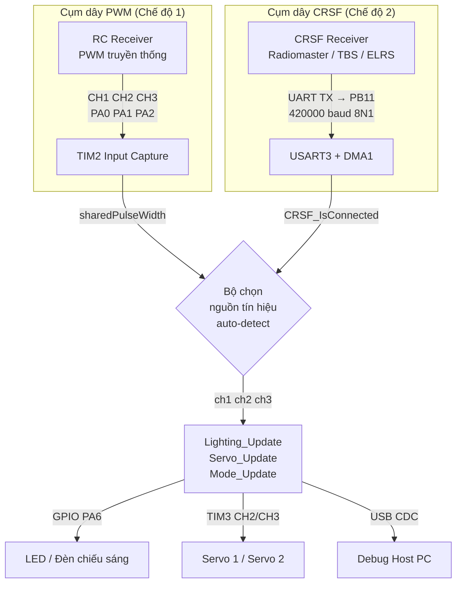

**Nguyên tắc auto-detect:**
- Cả hai đường UART3 (DMA) và TIM2 (Capture) luôn hoạt động đồng thời.
- Trong `main` loop: nếu `CRSF_Input_IsConnected() == 1` → dùng kênh CRSF; ngược lại → dùng `RC_Input_GetChX()` từ PWM.
- Người dùng chỉ cần cắm đúng cụm dây tương ứng, firmware tự chuyển nguồn.

---

## 2. Hardware Platform

### 2.1 MCU Specifications

| Parameter | Value |
|---|---|
| Part | STM32G431CBUx |
| Core | ARM Cortex-M4 + FPU + DSP |
| Max Clock | 170 MHz |
| Flash | 128 KB |
| SRAM | 32 KB |
| Package | UFQFPN48 |
| Operating Voltage | 1.71 – 3.6 V |

### 2.2 Peripheral Usage Summary

| Peripheral | Mode | Purpose |
|---|---|---|
| TIM2 | Input Capture (3 ch) | Đọc tín hiệu PWM từ RC receiver (chế độ PWM) |
| TIM3 | PWM Output (2 ch) | Điều khiển servo motor |
| USART3 | UART RX @ 420 kbaud | Nhận dữ liệu CRSF từ bộ thu RF (chế độ CRSF) |
| DMA1 Ch1 | Circular, Periph→Mem | Nhận USART3 RX không cần ngắt |
| GPIO PA6 | Output Push-Pull | Điều khiển đèn LED |
| USB FS | CDC Device | Debug Virtual COM Port |
| SysTick | System Timer | `HAL_GetTick()`, timeout tracking |

---

## 3. Software Stack

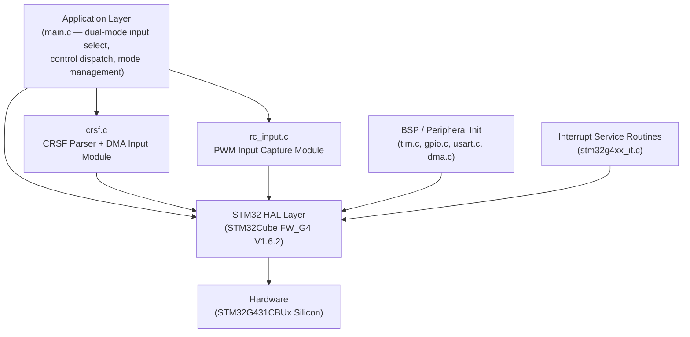

| Layer | Files | Responsibility |
|---|---|---|
| **Application** | `main.c` | Dual-mode input select, FSM dispatch, mode management |
| **CRSF Input** | `crsf.c / crsf.h` | DMA buffer management, CRSF frame parser, high-level API |
| **RC PWM Input** | `rc_input.c / rc_input.h` | TIM2 IC callback, pulse width calculation, timeout |
| **Servo Control** | `servo_control.c / .h` | Linear scaling, TIM3 CCR output |
| **Lighting FSM** | `lighting_control.c / .h` | OFF / ON / SOS state machine |
| **Mode Manager** | `mode_manager.c / .h` | NORMAL ↔ DEMO gesture detection |
| **Demo** | `demo_performance.c / .h` | 7-step autonomous lighting sequence |
| **Peripheral Init** | `tim.c`, `gpio.c`, `usart.c`, `dma.c` | CubeMX-generated HAL init |
| **USB Middleware** | `USB_Device/`, `Middlewares/` | CDC VCP driver |

---

## 4. Module Architecture

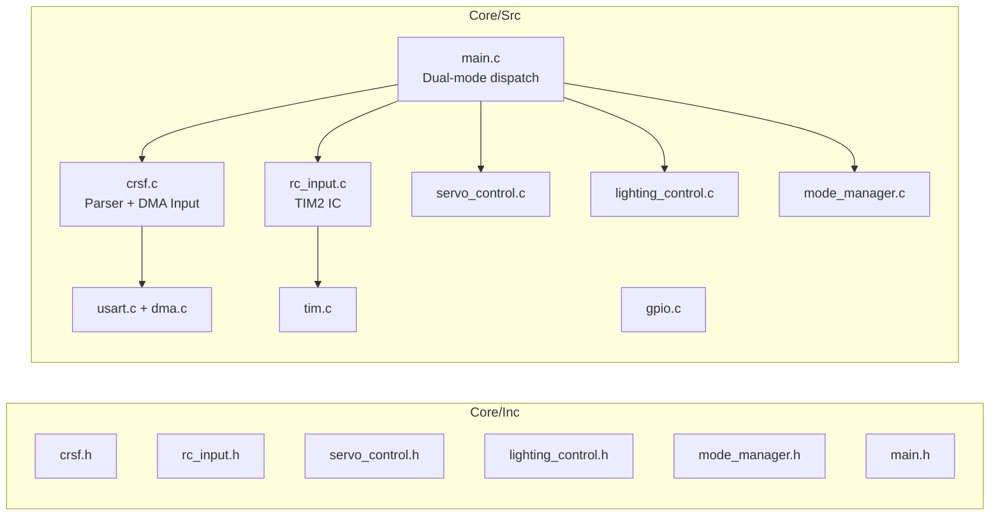

---

## 5. Dual-Mode Input Architecture

Đây là phần cốt lõi được bổ sung trong v2.0. Cả hai nguồn tín hiệu hoạt động song song và firmware tự chọn nguồn ưu tiên:

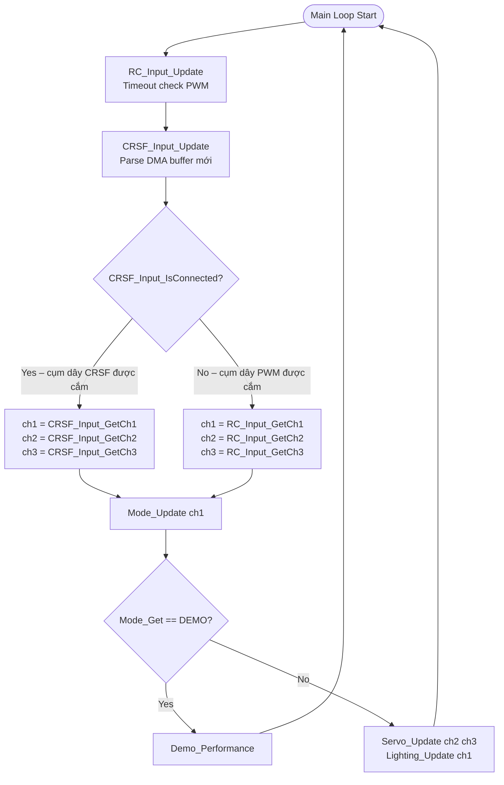

### Điều kiện chuyển chế độ

| Tình huống | Kết quả |
|---|---|
| Cắm cụm dây CRSF, bộ thu đang hoạt động | `CRSF_Input_IsConnected() == 1` → dùng CRSF |
| Tháo cụm dây CRSF (hoặc tắt bộ thu) | Sau `CRSF_TIMEOUT_MS` = 300 ms → `is_connected = 0` → tự chuyển về PWM |
| Chỉ cắm cụm dây PWM | CRSF không có packet → luôn dùng PWM |
| Cắm đồng thời cả 2 | CRSF được ưu tiên khi có tín hiệu |

---

## 6. Peripheral Configuration

### 6.1 TIM2 — Input Capture (PWM Decoder)

| Parameter | Value | Calculation |
|---|---|---|
| Source Clock | APB1 = 170 MHz | |
| Prescaler | 169 | 170 MHz / 170 = **1 µs/tick** |
| Period (ARR) | 0xFFFFFFFF | 32-bit, không tràn trong thực tế |
| Channels | CH1 (PA0), CH2 (PA1), CH3 (PA2) | Input Capture |
| IRQ Priority | 0 (highest) | Time-critical |

### 6.2 TIM3 — PWM Output (Servo Driver)

| Parameter | Value |
|---|---|
| Prescaler | 169 → 1 µs/tick |
| Period (ARR) | 19999 → 20 ms = 50 Hz |
| Channels | CH2 (PA4), CH3 (PB0) |

### 6.3 USART3 — CRSF Receiver

| Parameter | Value | Ghi chú |
|---|---|---|
| Baud Rate | **420 000** | CRSF chuẩn 416 666, sai số < 1% |
| Word Length | 8 bits | |
| Parity | None | |
| Stop Bits | 1 | |
| Mode | RX (+ TX dự phòng telemetry) | |
| DMA RX | DMA1_Ch1, **Circular** | Nhận liên tục, không cần ngắt |
| Interrupt | USART3 global (tùy chọn) | Không bắt buộc khi dùng DMA polling |

### 6.4 DMA1 — USART3_RX

| Parameter | Value |
|---|---|
| Instance | DMA1_Channel1 |
| Direction | Periph → Memory |
| Mode | **Circular** |
| Buffer size | 128 byte (`CRSF_DMA_BUF_SIZE`) |
| Data width | Byte |

---

## 7. CRSF Protocol Implementation

### 7.1 Cấu trúc Frame CRSF

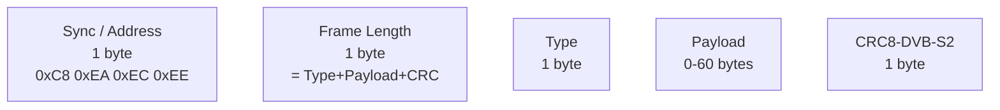

**Frame types được hỗ trợ:**

| Type | Hex | Payload | Mô tả |
|---|---|---|---|
| RC Channels | `0x16` | 22 bytes | 16 kênh × 11-bit (quan trọng nhất) |
| Link Statistics | `0x14` | 10 bytes | RSSI, LQ, SNR, TX Power |
| Battery Sensor | `0x08` | 8 bytes | Voltage, Current, Capacity, % |
| Attitude | `0x1E` | 6 bytes | Pitch, Roll, Yaw (rad × 10000) |
| Flight Mode | `0x21` | var | Null-terminated string |

### 7.2 Giải mã RC Channels (0x16)

16 kênh × 11 bit được đóng gói chặt trong 22 byte (little-endian bit stream):

```
CRSF raw range : 172 – 1811  (11-bit)
Center (1500µs): 992
Formula        : µs = (raw - 992) × 5/8 + 1500
Output clamp   : [1000, 2000] µs
```

### 7.3 DMA Circular Buffer Polling

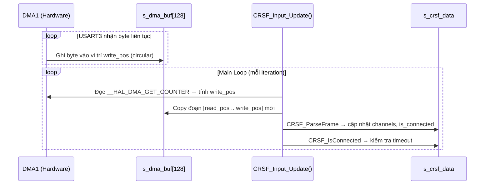

### 7.4 CRC-8/DVB-S2

- Polynomial: `0xD5` (x⁷+x⁶+x⁴+x²+x⁰)
- Init: `0x00`
- Tính trên: `[Type] + [Payload]` (KHÔNG bao gồm Sync và Length)
- Triển khai: lookup table 256 phần tử (`s_crc8_table[]`)

---

## 8. Signal Processing Pipeline

### 8.1 PWM Input Capture (TIM2)

Mỗi kênh dùng kỹ thuật đảo cực polarity:

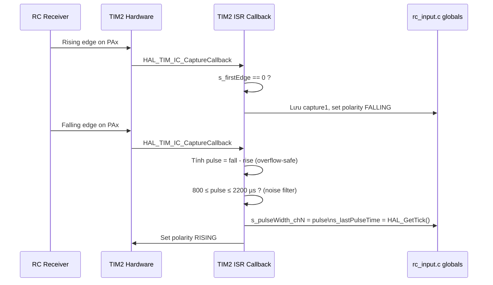

### 8.2 Signal Loss Detection

- **PWM:** `RC_Input_Update()` trong main loop, timeout = **200 ms** (`RC_TIMEOUT_MS`)
- **CRSF:** `CRSF_IsConnected()` trong `CRSF_Input_Update()`, timeout = **300 ms** (`CRSF_TIMEOUT_MS`)

Khi mất tín hiệu từ cả 2 nguồn → ch1=ch2=ch3=0 → servo về trung tâm, đèn tắt (failsafe).

---

## 9. Lighting Control State Machine

CH1 (µs) → quyết định trạng thái đèn (áp dụng cho cả 2 chế độ input):

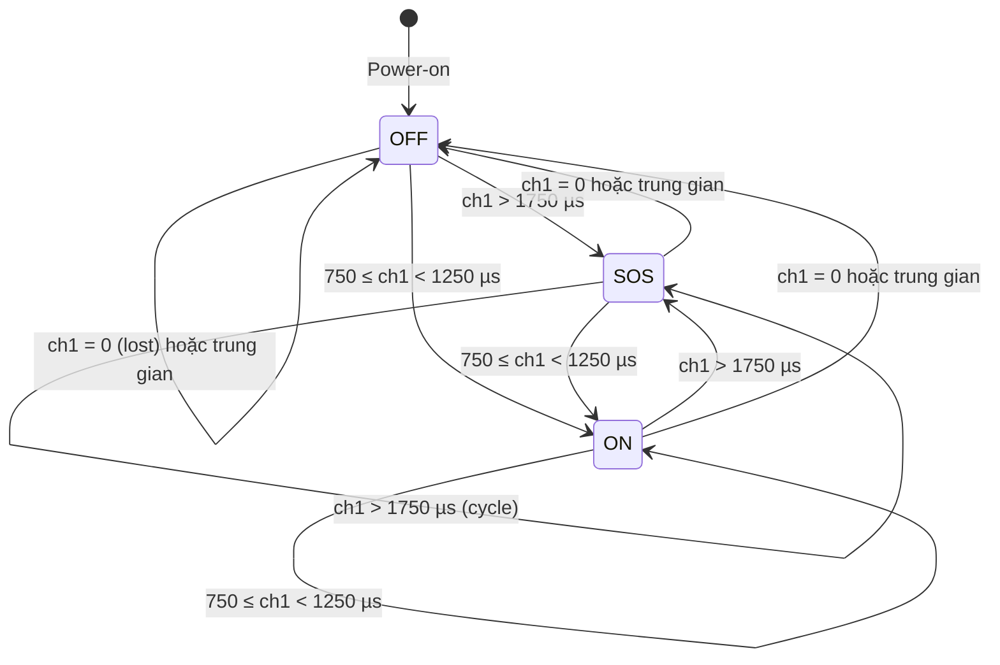

| Pulse Width (µs) | Trạng thái | Hành động |
|---|---|---|
| 0 (timeout) | OFF | GPIO_PIN_RESET |
| 750 – 1249 | ON | GPIO_PIN_SET |
| 1250 – 1750 | OFF | GPIO_PIN_RESET |
| > 1750 | SOS | Non-blocking SOS Morse |

---

## 10. Servo Control Logic

CH2, CH3 → TIM3 CCR (linear mapping):

```
outPWM = (inputPulse - 1000) × 2 + 500
Clamp: [500, 2500] µs
Signal lost (=0): CCR = 0 (servo unpowered)
```

| Input (µs) | Output (µs) | Servo Position |
|---|---|---|
| 1000 | 500 | 0° |
| 1500 | 1500 | 90° |
| 2000 | 2500 | 180° |

---

## 11. Interrupt & Execution Model

Mô hình foreground/background (superloop + ISR), không RTOS:

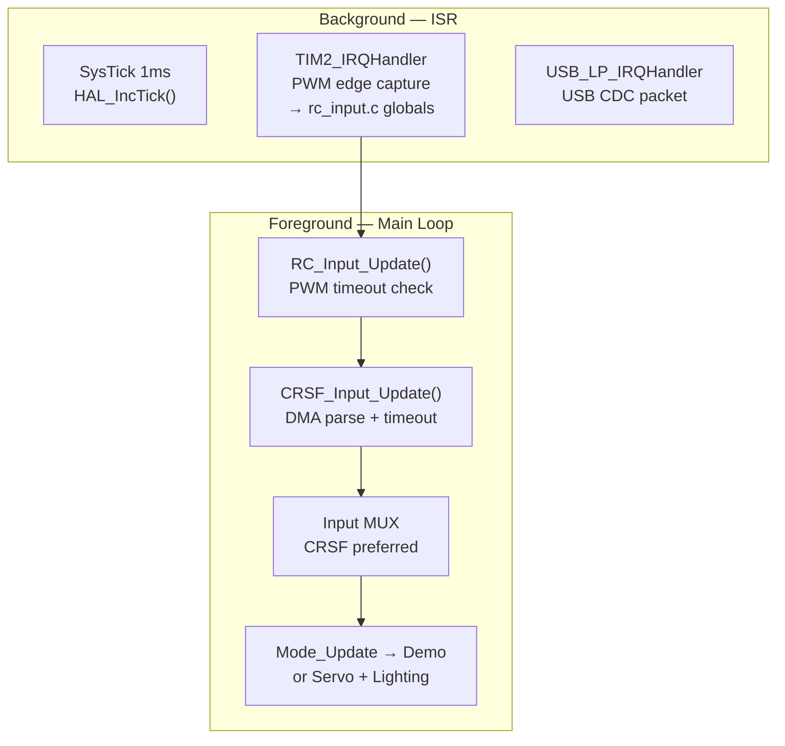

---

## 12. Data Flow Diagram

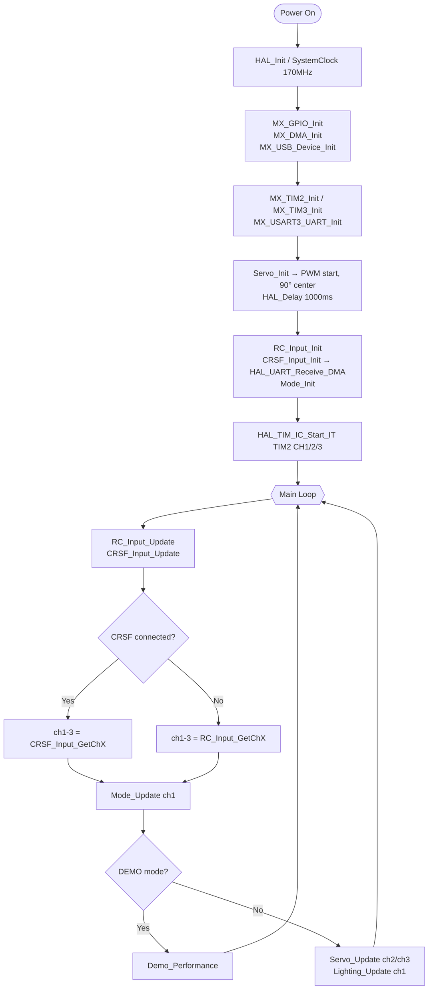

---

## 13. Pin Assignment Table

| Pin | Signal | Direction | Peripheral | Description |
|---|---|---|---|---|
| **PA0** | TIM2_CH1 | IN | TIM2 IC CH1 | PWM — Lighting channel |
| **PA1** | TIM2_CH2 | IN | TIM2 IC CH2 | PWM — Servo 1 |
| **PA2** | TIM2_CH3 | IN | TIM2 IC CH3 | PWM — Servo 2 |
| **PA4** | TIM3_CH2 | OUT | TIM3 PWM | Servo 1 output |
| **PA6** | GPIO_Output | OUT | GPIO | LED / Lighting output |
| **PA11** | USB_DM | USB | USB FS | USB D- |
| **PA12** | USB_DP | USB | USB FS | USB D+ |
| **PB0** | TIM3_CH3 | OUT | TIM3 PWM | Servo 2 output |
| **PB10** | USART3_TX | OUT | USART3 | CRSF Telemetry TX (dự phòng) |
| **PB11** | USART3_RX | IN | USART3+DMA | **CRSF Receiver data input** |
| **PC6** | GPIO_Output | OUT | GPIO | Secondary LED (reserved) |

---

## 14. Clock Tree

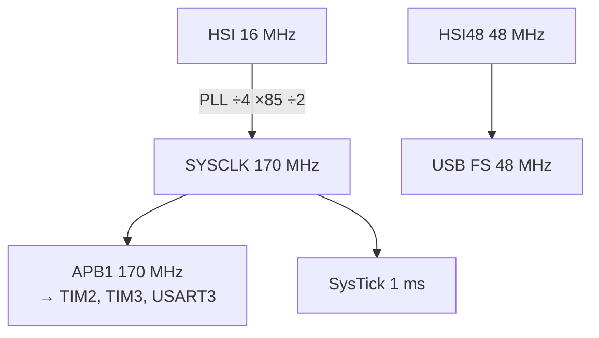

- **TIM2/TIM3:** Prescaler 169 → **1 µs/tick**
- **USART3:** BRR = 170 000 000 / 420 000 ≈ 405 → **actual ≈ 420 kbaud**

---

## 15. Memory Layout

```
FLASH (128 KB) @ 0x0800_0000
  .isr_vector, .text, .rodata (s_crc8_table, sosDelays, ...)

SRAM (32 KB) @ 0x2000_0000
  .data / .bss:
    s_dma_buf[128]         — CRSF DMA receive buffer
    s_crsf_data            — CRSF parsed data struct (~60 bytes)
    s_pulseWidth_chN (×3)  — PWM shared vars
    s_lastPulseTime_chN    — PWM timeout timestamps
  Heap  : 512 B
  Stack : 1 KB (grows down)
```

---

## 16. Known Limitations & Future Work

| # | Vấn đề | Tác động |
|---|---|---|
| 1 | CRSF parse được thực hiện trực tiếp trên DMA buffer; nếu DMA wrap xảy ra giữa chừng một frame thì frame đó bị bỏ qua | Ít xảy ra ở 100 Hz, buffer 128 byte |
| 2 | Chưa gửi Telemetry (Link Stats, Battery) ngược về TX qua USART3 TX | Tính năng nâng cao, dùng PB10 |
| 3 | `sosStep` và GPIO không được bảo vệ nếu CRSF parser và PWM cùng trigger | An toàn trong mô hình single-thread hiện tại |
| 4 | Chưa có signal quality counter (debounce) cho CRSF reconnect | Brief jitter khi signal intermittent |

### Hướng cải thiện

| Priority | Cải tiến |
|---|---|
| 🔴 High | Thêm CRSF Telemetry: gửi Battery/Link Stats ngược về TX |
| 🟡 Medium | Tăng `CRSF_DMA_BUF_SIZE` lên 256 để giảm khả năng wrap |
| 🟡 Medium | Thêm debounce counter cho `is_connected` (≥3 gói liên tiếp mới coi là kết nối) |
| 🟢 Low | Thêm diagnostic LED hoặc USB CDC log khi chuyển đổi giữa 2 chế độ input |

---

*Document v2.0 — Updated to reflect Dual-Mode PWM/CRSF Input — May 2026.*
