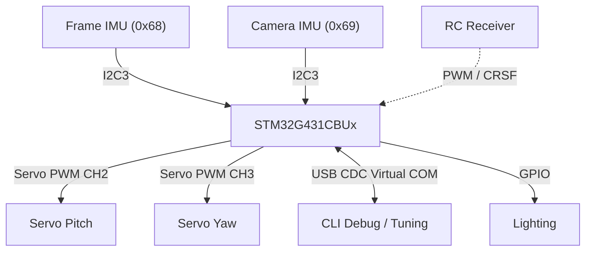
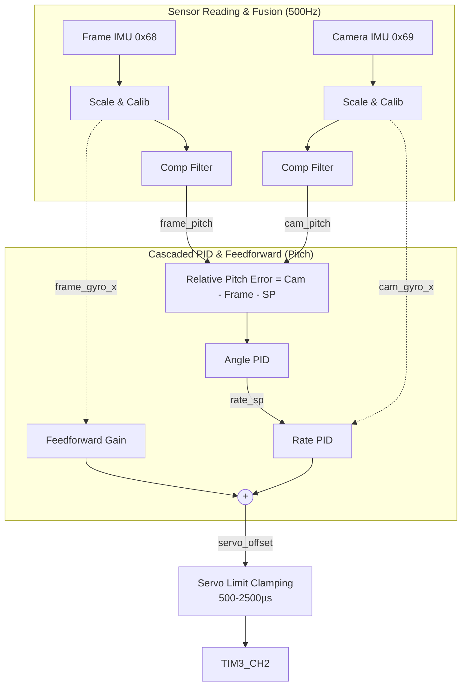
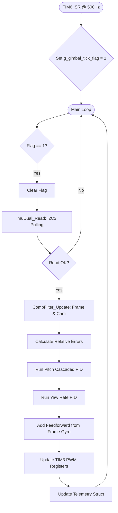

# STM32G4_Lighting — Firmware Architecture Document

**Document Version:** 3.0  
**MCU:** STM32G431CBUx (Cortex-M4, 170 MHz, 128 KB Flash, 32 KB RAM)  
**Package:** UFQFPN48  
**Toolchain:** STM32CubeMX + CMake + ARM GCC  
**HAL:** STM32Cube FW_G4 V1.6.2  
**Date:** 2026-05-20

---

## Table of Contents

1. [System Overview](#1-system-overview)
2. [Hardware Platform & Pinout](#2-hardware-platform--pinout)
3. [Software Stack & Module Architecture](#3-software-stack--module-architecture)
4. [Operating Modes](#4-operating-modes)
5. [Dual-IMU Gimbal Stabilization Architecture](#5-dual-imu-gimbal-stabilization-architecture)
6. [Interrupt & Execution Model](#6-interrupt--execution-model)
7. [UART CLI & Debugging](#7-uart-cli--debugging)

---

## 1. System Overview

The **STM32G4_Lighting** firmware acts as a multi-functional controller designed for robotics and camera stabilization:
1. **Dual-IMU Gimbal Stabilizer:** Uses a Frame IMU (0x68) to detect external disturbances and a Camera IMU (0x69) to measure actual platform orientation, combined with feedforward cascaded PID control running at a fixed 500Hz loop.
2. **Servo Driver:** Precise PWM generation for 2 axes (Pitch and Yaw) covering the full hobby servo range (500–2500 µs) at 50 Hz.
3. **Lighting Controller & RC Receiver:** Receives PWM/CRSF signals to control lighting sequences and autonomous demo performances.

---

## 2. Hardware Platform & Pinout

### Peripheral Configuration

| Peripheral | Purpose | Configuration (STM32CubeMX) |
|---|---|---|
| **TIM2** | RC Input Capture | Prescaler: 169 (1MHz tick), 32-bit Up-counting, measures PWM high time. |
| **TIM3** | Servo PWM | Prescaler: 169 (1MHz tick), Period: 19999 (50Hz), generates 500-2500µs pulses. |
| **TIM6** | Gimbal Control Loop | Prescaler: 169, Period: 1999 → triggers a 500Hz interrupt (dt = 2ms). |
| **I2C3** | Dual MPU6050 | Fast Mode 400kHz. Uses polling read for deadlock safety inside the main loop. |
| **USB FS**| Debug & CLI | Virtual COM Port for telemetry and real-time PID tuning. |

### Pin Assignment

| Pin | Signal | Peripheral | Description |
|---|---|---|---|
| **PA4** | SERVO_PITCH | TIM3_CH2 | Output PWM for Pitch Servo |
| **PB0** | SERVO_YAW | TIM3_CH3 | Output PWM for Yaw Servo |
| **PA8** | I2C3_SCL | I2C3 | MPU6050 Clock (Open-Drain, 4.7kΩ pull-up required) |
| **PC11**| I2C3_SDA | I2C3 | MPU6050 Data (Open-Drain, 4.7kΩ pull-up required) |
| **PA0** | RC_CH1 | TIM2_CH1 | Input Capture for Mode toggle & Lighting |
| **PA1** | RC_CH2 | TIM2_CH2 | Input Capture for Pitch RC |
| **PA2** | RC_CH3 | TIM2_CH3 | Input Capture for Yaw RC |
| **PA6** | LIGHT_PIN | GPIO OUT | LED Control Pin |

*(Note: EXTI15 DRDY pin is deprecated in v3.0; I2C is polled synchronously at 500Hz via TIM6).*

---

## 3. Software Stack & Module Architecture

The firmware utilizes a highly modular C architecture.

| Layer | Files | Responsibility |
|---|---|---|
| **Application** | `main.c`, `mode_manager.c` | Superloop execution, operating mode switching, CLI processing, debug telemetry output. |
| **Gimbal Core** | `gimbal_control.c` | PID Controllers, setpoint management, feedforward logic, servo angle clamping. |
| **Sensor Fusion**| `fusion.c` | Complementary Filter (`α = 0.98`) to fuse Accelerometer and Gyroscope data into reliable angles. |
| **Hardware Drivers** | `imu_dual.c`, `servo_control.c` | Dual I2C read sequences, hardware initialization, calibration sequences, TIM3 PWM updates. |

---

## 4. Operating Modes

Managed by `mode_manager.c`. The system transitions between modes via a 5-tap gesture on the RC CH1 input, or defaults to GIMBAL on startup.

1. **GIMBAL MODE (Default at Startup):**
   - The primary stabilization state. The TIM6 ISR fires every 2ms to set `g_gimbal_tick_flag`.
   - The main loop consumes the flag, reads both IMUs, processes the Complementary Filter, calculates relative error, runs the PID loops, and updates TIM3.
2. **DEMO MODE:**
   - Autonomous pre-programmed servo and lighting performance sequence.
3. **NORMAL MODE:**
   - Direct RC pass-through to servos and lighting for manual control.

---

## 5. Dual-IMU Gimbal Stabilization Architecture

The stabilization system is based on a **Relative Error** model. The Frame IMU detects external chassis disturbances and immediately injects counter-movements via **Feedforward**. The Camera IMU ensures absolute orientation tracking, relying on a **Cascaded PID** structure (Angle → Rate) to drive the Pitch servo, and a **Rate PID** for the Yaw servo.

### 5.1 Block Diagram

### 5.2 Flowchart of `Gimbal_Tick`

---

## 6. Interrupt & Execution Model

The system uses a safe **Flag-Based Scheduling** approach to prevent I2C deadlocks. Running I2C blocking functions inside an ISR can cause hangs if priorities collide.

| Priority | Context | Task |
|---|---|---|
| High | `TIM6_DAC_IRQHandler` | Executes extremely fast (< 1µs). Sets `g_gimbal_tick_flag = 1`. |
| Med | `TIM2_IRQHandler` | Input capture interrupts for RC signals. |
| Low | `main()` while(1) | Fore-ground loop. Checks flag. If set, executes `Gimbal_Tick()` (takes ~400-500µs to read I2C and run math). |

---

## 7. UART CLI & Debugging

The firmware features an interactive USB CDC Virtual COM Port for real-time PID tuning and telemetry observation.

### Available CLI Commands
- `p Kp Ki Kd`: Set Pitch Angle PID gains.
- `P Kp Ki Kd`: Set Pitch Rate PID gains.
- `y Kp Ki Kd`: Set Yaw Rate PID gains.
- `f kff_p kff_y`: Set Feedforward gains.
- `a alpha`: Set Complementary Filter alpha.
- `s deg`: Set target Pitch Setpoint in degrees.
- `d`: Dump current parameters to console.
- `r`: Reset PID integral windup.

*(Implementation Note: Ensure `Gimbal_CLI_Feed` is hooked into the `CDC_Receive_FS` function in the `usbd_cdc_if.c` file to route incoming bytes to the parser).*
