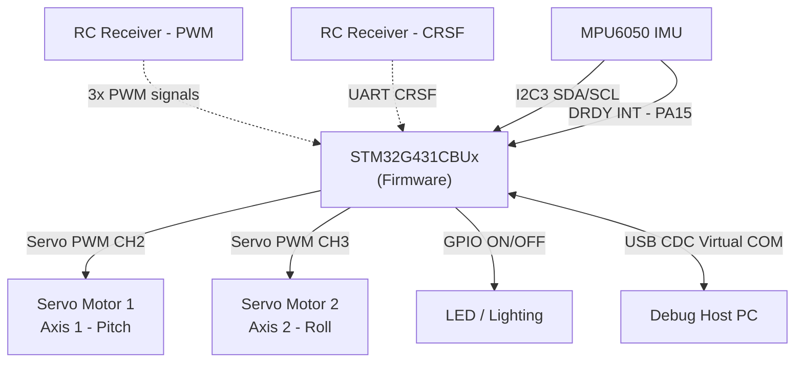
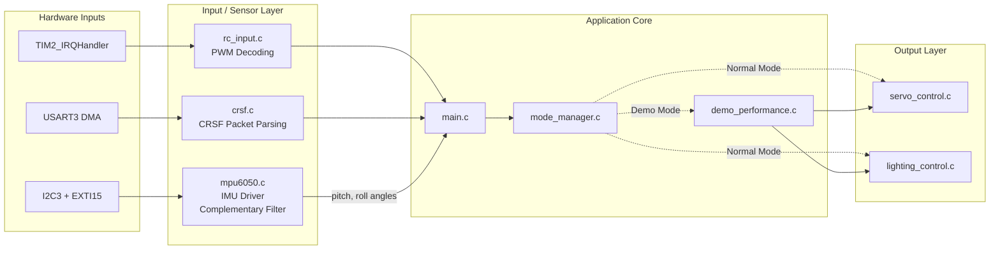
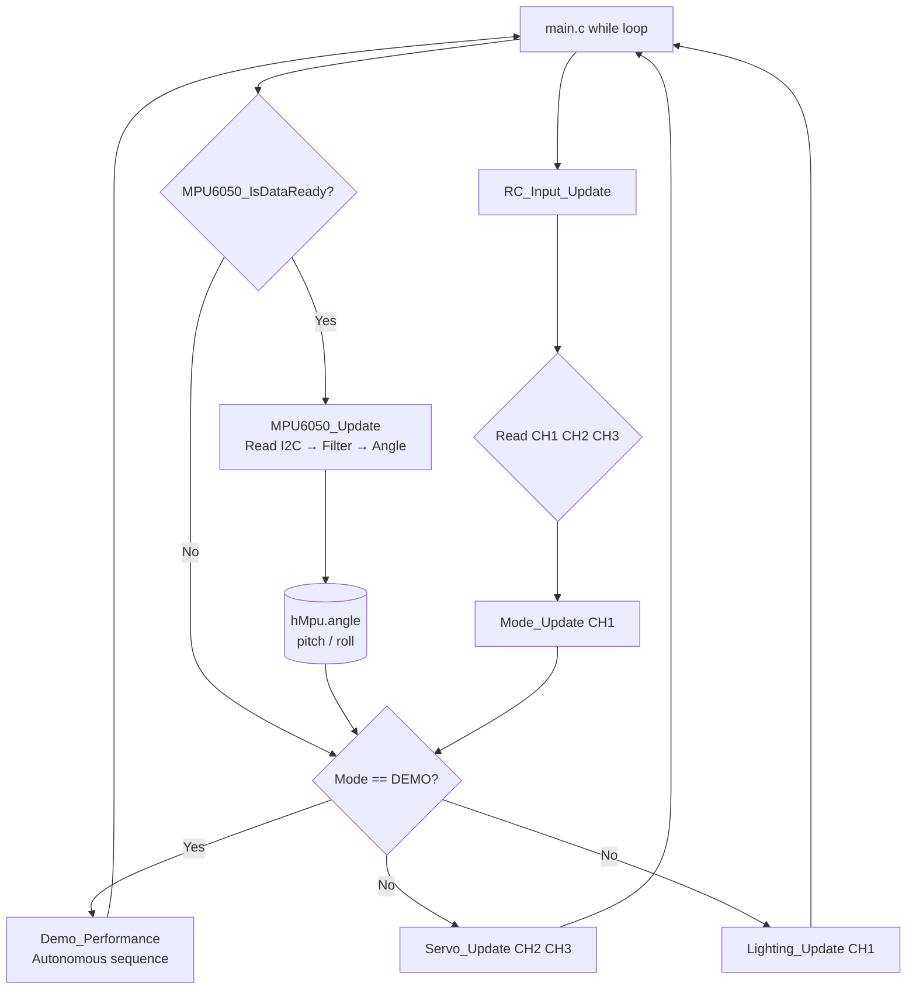

# STM32G4_Lighting — Firmware Architecture Document

**Document Version:** 2.1  
**MCU:** STM32G431CBUx (Cortex-M4, 170 MHz, 128 KB Flash, 32 KB RAM)  
**Package:** UFQFPN48  
**Toolchain:** STM32CubeMX + CMake + ARM GCC  
**HAL:** STM32Cube FW_G4 V1.6.2  
**Date:** 2026-05-18

---

## Table of Contents

1. [System Overview](#1-system-overview)
2. [Hardware Platform](#2-hardware-platform)
3. [Software Stack](#3-software-stack)
4. [Module Architecture](#4-module-architecture)
5. [Peripheral Configuration](#5-peripheral-configuration)
6. [Signal Processing Pipeline (PWM & CRSF)](#6-signal-processing-pipeline-pwm--crsf)
7. [MPU6050 Driver & Sensor Fusion](#7-mpu6050-driver--sensor-fusion)
8. [Operating Modes & Demo Sequence](#8-operating-modes--demo-sequence)
9. [Lighting Control State Machine](#9-lighting-control-state-machine)
10. [Servo Control Logic](#10-servo-control-logic)
11. [Interrupt & Execution Model](#11-interrupt--execution-model)
12. [Data Flow Diagram](#12-data-flow-diagram)
13. [Pin Assignment Table](#13-pin-assignment-table)
14. [Clock Tree](#14-clock-tree)
15. [Known Limitations & Future Work](#15-known-limitations--future-work)

---

## 1. System Overview

The **STM32G4_Lighting** firmware is designed to run on an STM32G431CBUx microcontroller acting as a **dual-mode signal router, lighting controller, servo driver, and IMU-based gimbal stabilizer**. Its core responsibilities are:

- **Receive** control signals via either **legacy PWM (TIM2)** or **high-speed CRSF Protocol (UART3 DMA)**.
- **Route and scale** servo outputs to two servo motors via TIM3 CH2 and CH3 (full 0°–180° range).
- **Decode CH1** to drive a LED/lighting system with distinct modes: OFF, ON, and SOS distress pattern.
- **Provide an Autonomous Demo Mode** that executes a predefined 8-step sequence of servo and lighting movements.
- **Read MPU6050 IMU** via I2C3, compute Pitch/Roll angles using a Complementary Filter, and provide processed angle data for PID-based 2-axis gimbal stabilization (future integration).
- **Protect** against signal loss by applying failsafes (servos return to 90° center position, lights off).



---

## 2. Hardware Platform

### 2.1 MCU Specifications

| Parameter | Value |
|---|---|
| Part | STM32G431CBUx |
| Core | ARM Cortex-M4 + FPU + DSP |
| Max Clock | 170 MHz |
| Flash | 128 KB |
| SRAM | 32 KB |

### 2.2 Peripheral Usage Summary

| Peripheral | Mode | Purpose |
|---|---|---|
| TIM2 | Input Capture (3 ch) | Read PWM signals from RC receiver |
| USART3 | DMA Circular Receive | Read CRSF protocol packets |
| TIM3 | PWM Output (2 ch) | Drive servo motors (50 Hz) |
| **I2C3** | **Fast Mode 400 kHz** | **MPU6050 communication (PA8=SCL, PC11=SDA)** |
| GPIO PA6 | Output Push-Pull | Primary LED lighting control |
| **GPIO PA15** | **EXTI15 Input** | **MPU6050 Data-Ready Interrupt** |
| USB FS | CDC Device | Debug Virtual COM Port |

---

## 3. Software Stack

The codebase uses a highly modular architecture.

| Layer | Modules | Responsibility |
|---|---|---|
| **Application** | `main.c`, `mode_manager.c`, `demo_performance.c` | Core loop, mode switching (Normal/Demo), autonomous routines. |
| **Control Logic** | `servo_control.c`, `lighting_control.c` | Servo angle mapping, limits, timeouts, lighting FSM (SOS). |
| **Input Drivers** | `rc_input.c`, `crsf.c` | PWM edge timing, signal loss, CRSF packet decoding, CRC-8 validation. |
| **IMU Driver** | **`mpu6050.c`** | **I2C read, sensor fusion (Complementary Filter), Pitch/Roll angle output.** |
| **HAL & Config** | `tim.c`, `gpio.c`, `i2c.c` | Peripheral initialization generated by STM32CubeMX. |

---

## 4. Module Architecture



---

## 5. Peripheral Configuration

### 5.1 TIM2 — Input Capture (PWM Decoder)
- **Source:** 170 MHz, **Prescaler:** 169 (1 µs tick)
- **Mode:** Free-running 32-bit Up-counting
- **Channels:** CH1 (PA0), CH2 (PA1), CH3 (PA2)

### 5.2 TIM3 — PWM Output (Servo Driver)
- **Source:** 170 MHz, **Prescaler:** 169 (1 µs tick)
- **Period (ARR):** 19999 (20 ms = 50 Hz)
- **Channels:** CH2 (PA4), CH3 (PB0)

### 5.3 USART3 — CRSF Input
- **Baudrate:** 420,000 bps, **Mode:** 8N1, DMA Circular

### 5.4 I2C3 — MPU6050

| Parameter | Value | Ghi chú |
|---|---|---|
| Pins | PA8 (SCL), PC11 (SDA) | Open-Drain, cần pull-up 4.7kΩ lên 3.3V |
| Speed | Fast Mode – 400 kHz | Cài `Timing = 0x40621236` trong CubeMX |
| Addressing | 7-bit | Địa chỉ MPU6050: `0x68` (AD0=GND) |
| Analog Filter | Enabled | Lọc glitch phần cứng |
| Digital Filter | 0 (off) | Bộ lọc phần mềm trong driver đủ dùng |

### 5.5 GPIO PA15 — MPU6050 Data-Ready Interrupt

| Parameter | Value |
|---|---|
| Pin | PA15 |
| Mode | `GPIO_MODE_IT_RISING` (cạnh lên) |
| Pull | Pull-Down (EXTI ổn định khi idle) |
| NVIC | `EXTI15_10_IRQn`, ưu tiên thấp hơn TIM2 |

> **Lưu ý CubeMX:** Cần bật `EXTI15_10` trong tab NVIC → Interrupt Table. PA15 mặc định dùng cho JTDI (debug), cần tắt SWJ/JTAG để dùng làm GPIO thông thường (hoặc chọn chế độ `No JTAG` trong `SYS → Debug → Serial Wire`).

---

## 6. Signal Processing Pipeline (PWM & CRSF)

Hệ thống trừu tượng hóa nguồn RC input. Dù dùng PWM hay CRSF, lớp ứng dụng luôn nhận định dạng xung 1000–2000 µs.

### 6.1 CRSF Protocol
- DMA nhận packet CRSF → `crsf.c` decode 16 kênh.
- Sync Byte + Length + CRC-8 validation.
- Kênh 11-bit (172–1811) → ánh xạ sang 1000–2000 µs.

### 6.2 PWM Protocol
- TIM2 Input Capture toggle-polarity trên 3 kênh.
- Lọc xung: chỉ chấp nhận 800–2200 µs.

### 6.3 Signal Loss Failsafe
Timeout 50 ms → servos về 90°, đèn tắt.

---

## 7. MPU6050 Driver & Sensor Fusion

### 7.1 Tổng quan Driver (`mpu6050.h` / `mpu6050.c`)

Driver được thiết kế theo mô hình **Handle-based** (giống HAL STM32):
- Khai báo một instance `MPU6050_Handle_t` trong ứng dụng.
- Tất cả trạng thái nội bộ được đóng gói trong struct, không dùng biến global.

### 7.2 Cấu trúc dữ liệu chính

```c
typedef struct {
    MPU6050_GyroFS_t   gyro_fs;         /* Dải đo Gyro (±250/500/1000/2000 °/s) */
    MPU6050_AccelFS_t  accel_fs;        /* Dải đo Accel (±2/4/8/16 g)           */
    float              gyro_sens;       /* Hệ số nhạy Gyro (LSB/°/s)            */
    float              accel_sens;      /* Hệ số nhạy Accel (LSB/g)             */
    MPU6050_RawData_t  raw;             /* Dữ liệu thô (int16, 6 trục + temp)   */
    MPU6050_ScaledData_t scaled;        /* Dữ liệu quy đổi (g, °/s, °C)        */
    MPU6050_Angle_t    angle;           /* Góc Pitch/Roll (°) - output          */
    float              comp_filter_alpha; /* Hệ số bộ lọc bù (0.96 mặc định)   */
    uint32_t           last_tick;       /* Timestamp lần đọc cuối (cho dt)      */
    volatile uint8_t   data_ready_flag; /* Cờ ngắt DRDY từ PA15                */
    uint8_t            initialized;     /* Trạng thái khởi tạo                  */
} MPU6050_Handle_t;
```

### 7.3 Public API

| Hàm | Mô tả |
|---|---|
| `MPU6050_Init()` | Kiểm tra WHO_AM_I, reset, cấu hình gyro/accel range, DLPF, bật ngắt DRDY |
| `MPU6050_ReadRaw()` | Burst-read 14 byte (Accel XYZ + Temp + Gyro XYZ) từ thanh ghi 0x3B |
| `MPU6050_ConvertScaled()` | Chia raw cho sensitivity → đơn vị g, °/s, °C |
| `MPU6050_UpdateAngle()` | Tính góc Pitch/Roll bằng Complementary Filter |
| `MPU6050_Update()` | Gọi 3 hàm trên theo thứ tự (tiện ích) |
| `MPU6050_DRDY_Callback()` | Đặt cờ `data_ready_flag` – gọi từ `HAL_GPIO_EXTI_Callback()` |
| `MPU6050_IsDataReady()` | Kiểm tra và xóa cờ DRDY (atomic-safe) |
| `MPU6050_GetTemperature()` | Đọc nhiệt độ chip (°C) |
| `MPU6050_Reset()` | Software reset chip |

### 7.4 Thuật toán Complementary Filter

```
Accel → tính góc tuyệt đối (nhiễu ngắn hạn, ổn định dài hạn)
Gyro  → tích phân tốc độ góc (nhanh, nhưng drift theo thời gian)

angle = α × (angle + gyro_rate × dt) + (1-α) × accel_angle
```

| Tham số | Giá trị mặc định | Ý nghĩa |
|---|---|---|
| `α` (alpha) | `0.96` | 96% Gyro + 4% Accel |
| Sample rate | 100 Hz (SMPLRT_DIV=9) | dt ≈ 10 ms |
| DLPF | `MPU6050_DLPF_BW_044HZ` | Cắt nhiễu cao tần trên 44 Hz |

### 7.5 Chuỗi khởi tạo trong `main.c`

```c
/* Khai báo (biến toàn cục hoặc static trong main.c) */
MPU6050_Handle_t hMpu;

/* Trong phần USER CODE BEGIN 2, sau MX_I2C1_Init() */
if (MPU6050_Init(&hMpu,
                  MPU6050_GYRO_FS_500DPS,
                  MPU6050_ACCEL_FS_4G,
                  MPU6050_DLPF_BW_044HZ) != HAL_OK)
{
    /* Xử lý lỗi: cảm biến không kết nối */
    Error_Handler();
}

/* Trong HAL_GPIO_EXTI_Callback() (thêm vào main.c) */
void HAL_GPIO_EXTI_Callback(uint16_t GPIO_Pin)
{
    if (GPIO_Pin == MPU6050_INT_PIN)
    {
        MPU6050_DRDY_Callback(&hMpu);
    }
}

/* Trong main loop */
if (MPU6050_IsDataReady(&hMpu))
{
    MPU6050_Update(&hMpu);
    /* hMpu.angle.pitch và hMpu.angle.roll sẵn sàng cho PID */
}
```

### 7.6 Sequence Diagram – Luồng Data-Ready Interrupt

```mermaid
sequenceDiagram
    participant HW as MPU6050 Hardware
    participant PA15 as PA15 EXTI15
    participant ISR as HAL_GPIO_EXTI_Callback
    participant DRIVER as mpu6050.c
    participant LOOP as Main Loop

    HW->>PA15: Kéo INT cao (Data Ready)
    PA15->>ISR: EXTI15_10_IRQHandler
    ISR->>DRIVER: MPU6050_DRDY_Callback(&hMpu)
    DRIVER->>DRIVER: data_ready_flag = 1

    loop Mỗi iteration main loop
        LOOP->>DRIVER: MPU6050_IsDataReady(&hMpu)
        alt flag == 1
            DRIVER-->>LOOP: return 1 (xóa flag)
            LOOP->>DRIVER: MPU6050_Update(&hMpu)
            DRIVER->>HW: I2C Burst Read 14 bytes
            HW-->>DRIVER: Accel XYZ + Gyro XYZ + Temp
            DRIVER->>DRIVER: ConvertScaled()
            DRIVER->>DRIVER: UpdateAngle() - Complementary Filter
            LOOP->>LOOP: Dùng hMpu.angle.pitch / .roll
        else flag == 0
            DRIVER-->>LOOP: return 0
        end
    end
```

---

## 8. Operating Modes & Demo Sequence

Managed by `mode_manager.c`. CH1 toggle pattern → switch `APP_MODE_NORMAL` ↔ `APP_MODE_DEMO`.

**Demo Performance** (`demo_performance.c`): Chuỗi 8 bước tự động, không block. Khi thoát về Normal, servo ép về 90° an toàn trước khi trả quyền cho RC.

---

## 9. Lighting Control State Machine

Managed by `lighting_control.c`. Maps CH1 input → LED on PA6.

| Pulse Width (µs) | State | LED Action |
|---|---|---|
| 0 (lost) / < 1000 | **OFF** | `GPIO_PIN_RESET` |
| 1000 – 1249 | **ON** | `GPIO_PIN_SET` |
| 1250 – 1750 | **OFF** | `GPIO_PIN_RESET` |
| > 1750 | **SOS** | Non-blocking Morse Code Pattern |

---

## 10. Servo Control Logic

Managed by `servo_control.c`. CH2/CH3 (1000–2000 µs) → TIM3 PWM (servo 0°–180°).

- **Startup:** Servos về 90° (1500 µs) và giữ 1 giây để ổn định cơ khí.
- **Incremental stepping:** Servo di chuyển từng bước nhỏ (không nhảy đột ngột) → không gây tiếng "tạch tạch".
- **Failsafe:** Mất tín hiệu → servo về 90° trung tâm.

> **Tương lai – Gimbal Mode:** `Servo_Update()` sẽ nhận giá trị từ PID output thay vì trực tiếp từ RC, sử dụng `hMpu.angle.pitch`/`.roll` làm feedback.

---

## 11. Interrupt & Execution Model

**Foreground/Background, không RTOS.**

| Context | Handler | Tác vụ |
|---|---|---|
| ISR – SysTick (1ms) | `SysTick_Handler` | `HAL_IncTick()` |
| ISR – TIM2 | `TIM2_IRQHandler` | Capture edge, tính pulse width |
| ISR – DMA USART3 | `DMA1_Channel2_IRQHandler` | Copy CRSF byte vào ring buffer |
| ISR – EXTI15 | `EXTI15_10_IRQHandler` | `MPU6050_DRDY_Callback()` → đặt cờ |
| Foreground Loop | `main()` while(1) | `RC_Input_Update()`, `Mode_Update()`, `MPU6050_IsDataReady()`, điều khiển servo/đèn |

---

## 12. Data Flow Diagram



---

## 13. Pin Assignment Table

| Pin | Signal | Direction | Peripheral | Description |
|---|---|---|---|---|
| **PA0** | TIM2_CH1 | IN | TIM2 IC CH1 | RC PWM — Lighting / Mode Toggle |
| **PA1** | TIM2_CH2 | IN | TIM2 IC CH2 | RC PWM — Servo 1 (Pitch axis) |
| **PA2** | TIM2_CH3 | IN | TIM2 IC CH3 | RC PWM — Servo 2 (Roll axis) |
| **PA4** | TIM3_CH2 | OUT | TIM3 PWM CH2 | Servo 1 output |
| **PA6** | LIGHT_PIN | OUT | GPIO | Primary LED / lighting output |
| **PA8** | I2C3_SCL | I/O | I2C3 | MPU6050 Clock (Open-Drain, 4.7kΩ pull-up) |
| **PC11** | I2C3_SDA | I/O | I2C3 | MPU6050 Data (Open-Drain, 4.7kΩ pull-up) |
| **PA15** | EXTI15 | IN | GPIO / EXTI | MPU6050 Data-Ready Interrupt (Pull-Down) |
| **PB0** | TIM3_CH3 | OUT | TIM3 PWM CH3 | Servo 2 output |
| **PB10** | USART3_TX | OUT | USART3 | CRSF TX (Optional Telemetry) |
| **PB11** | USART3_RX | IN | USART3 | CRSF RX (DMA) |

---

## 14. Clock Tree

- **HSI:** 16 MHz → PLL (÷4 → ×85 → ÷2) = **170 MHz SYSCLK**
- **APB1 Timer Clock:** 170 MHz (TIM2, TIM3, I2C1)
- **HSI48:** 48 MHz → USB FS

---

## 15. Known Limitations & Future Work

### Đã được giải quyết (v2.x)
- ✅ Servo tạch tạch → incremental stepping, failsafe về 90°.
- ✅ CRSF driver (`crsf.c`) đã hoàn chỉnh.
- ✅ Code refactored thành module riêng biệt.
- ✅ MPU6050 driver (`mpu6050.c`) hoàn chỉnh với Complementary Filter.

### Cần triển khai tiếp theo

| Ưu tiên | Hạng mục |
|---|---|
| 🔴 High | **Gimbal PID Loop:** Viết `gimbal_control.c` với bộ điều khiển PID 2 trục (Pitch/Roll). Sử dụng `hMpu.angle` làm feedback, output đến `Servo_SetAngle()`. |
| 🔴 High | **Gimbal Mode trong `mode_manager.c`:** Thêm `APP_MODE_GIMBAL` để chuyển chế độ ổn định tự động. |
| 🟡 Medium | **Calibration:** Lưu gyro offset (bias) vào Flash sau khi hiệu chuẩn, load lại khi reset. |
| 🟡 Medium | **Nâng cấp lên Madgwick Filter** để có độ chính xác góc tốt hơn khi gimbal di chuyển nhanh. |
| 🟢 Low | **CRSF Telemetry:** Gửi dữ liệu góc Pitch/Roll về transmitter qua USART3 TX. |
| 🟢 Low | **USB Debug:** In giá trị `pitch`, `roll`, servo output theo chu kỳ qua CDC VCP để dễ debug PID. |

---
*Document maintained by firmware team — Last updated: May 2026 (v2.1).*
