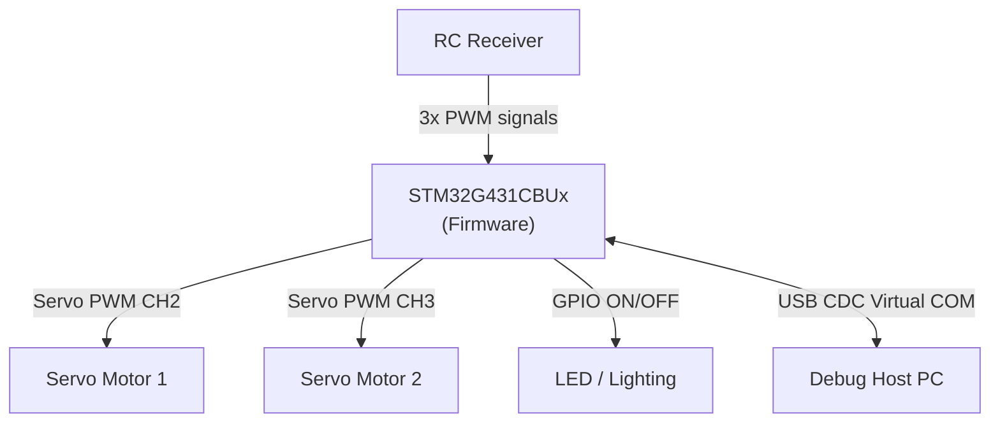
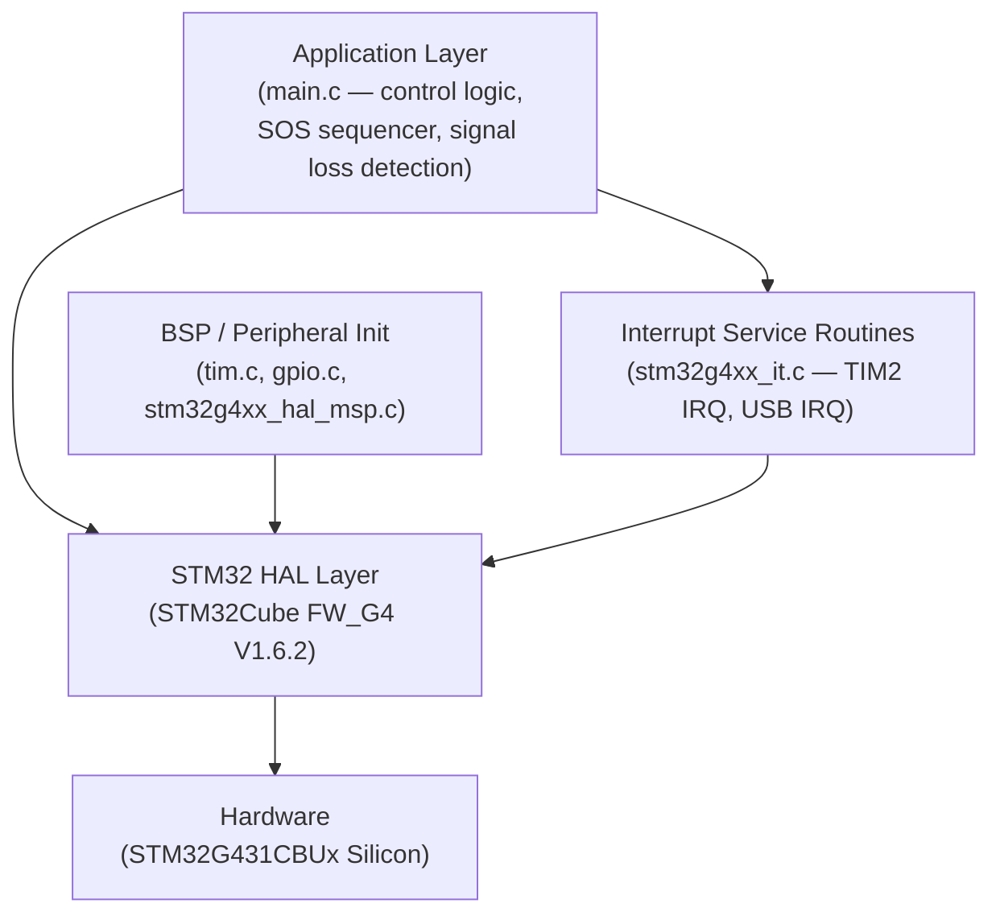
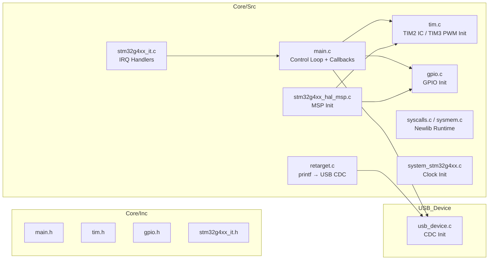
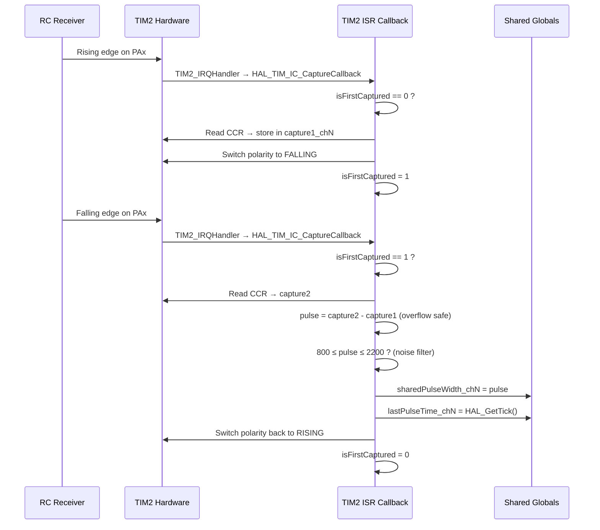
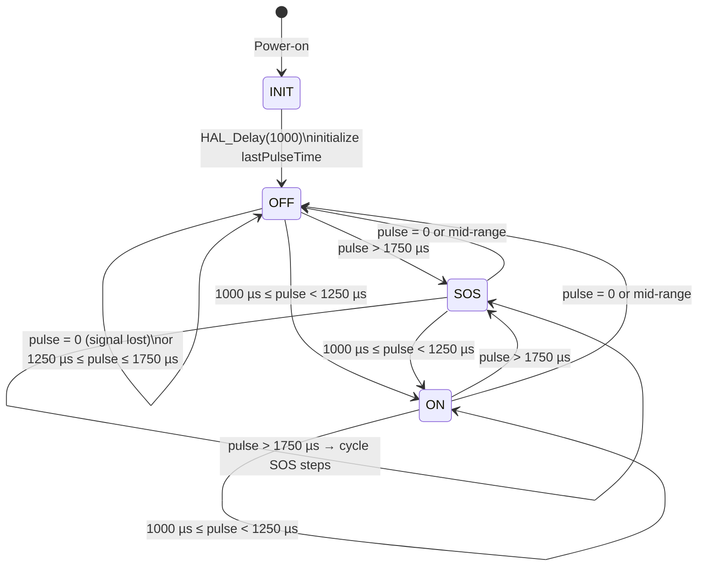
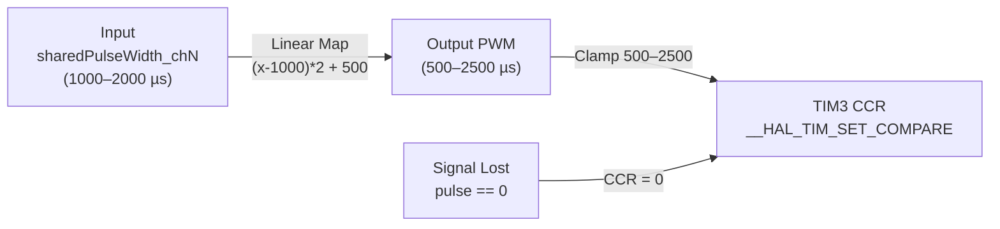
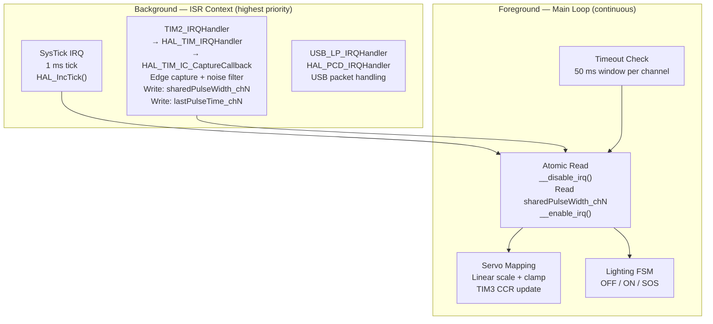
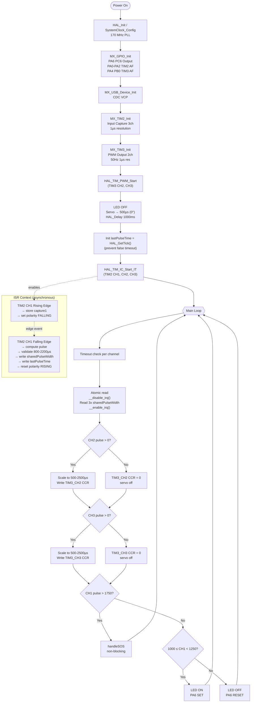
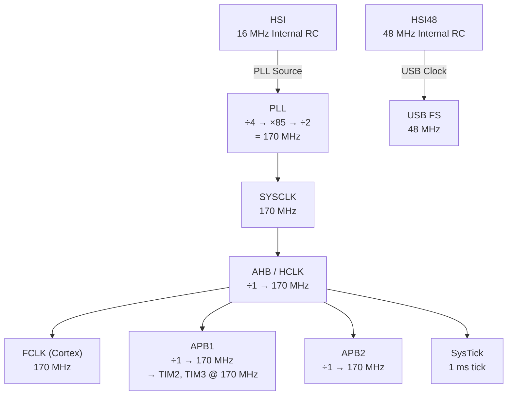

# STM32G4_Lighting — Firmware Architecture Document

**Document Version:** 1.0  
**MCU:** STM32G431CBUx (Cortex-M4, 170 MHz, 128 KB Flash, 32 KB RAM)  
**Package:** UFQFPN48  
**Toolchain:** STM32CubeMX + CMake + ARM GCC  
**HAL:** STM32Cube FW_G4 V1.6.2  
**Date:** 2026-04-25

---

## Table of Contents

1. [System Overview](#1-system-overview)
2. [Hardware Platform](#2-hardware-platform)
3. [Software Stack](#3-software-stack)
4. [Module Architecture](#4-module-architecture)
5. [Peripheral Configuration](#5-peripheral-configuration)
6. [Signal Processing Pipeline](#6-signal-processing-pipeline)
7. [Lighting Control State Machine](#7-lighting-control-state-machine)
8. [Servo Control Logic](#8-servo-control-logic)
9. [Interrupt & Execution Model](#9-interrupt--execution-model)
10. [Data Flow Diagram](#10-data-flow-diagram)
11. [Pin Assignment Table](#11-pin-assignment-table)
12. [Clock Tree](#12-clock-tree)
13. [Memory Layout](#13-memory-layout)
14. [Known Limitations & Future Work](#14-known-limitations--future-work)

---

## 1. System Overview

The **STM32G4_Lighting** firmware is designed to run on an STM32G431CBUx microcontroller acting as a **signal router and lighting controller** in an RC (Radio-Control) vehicle or aerial platform system. Its core responsibilities are:

- **Receive** up to three independent PWM signals from an RC receiver (CH1, CH2, CH3) via hardware Input Capture (TIM2).
- **Route and scale** servo PWM outputs back to two servo motors via TIM3 CH2 and CH3.
- **Decode CH1 pulse width** to drive a LED/lighting system with three distinct modes: OFF, ON, and SOS distress pattern.
- **Protect** against signal loss by applying a 50 ms timeout — outputs are zeroed on loss of signal.
- **Validate** every captured pulse against the standard RC PWM window (800 – 2200 µs) to reject electrical noise.
- Provide a **USB CDC (Virtual COM Port)** interface for optional debug output.



---

## 2. Hardware Platform

### 2.1 MCU Specifications

| Parameter | Value |
|---|---|
| Part | STM32G431CBUx |
| Core | ARM Cortex-M4 + FPU + DSP |
| Max Clock | 170 MHz |
| Flash | 128 KB |
| SRAM | 32 KB |
| Package | UFQFPN48 |
| Operating Voltage | 1.71 – 3.6 V |

### 2.2 Peripheral Usage Summary

| Peripheral | Mode | Purpose |
|---|---|---|
| TIM2 | Input Capture (3 ch) | Read PWM signals from RC receiver |
| TIM3 | PWM Output (2 ch) | Drive servo motors |
| GPIO PA6 | Output Push-Pull | LED lighting control |
| GPIO PC6 | Output Push-Pull | Secondary LED / reserved output |
| USB FS | CDC Device | Debug Virtual COM Port |
| SysTick | System Timer | HAL tick, `HAL_GetTick()`, timeout tracking |
| NVIC | Interrupt Controller | TIM2 IRQ priority 0 (highest), USB LP |

---

## 3. Software Stack



| Layer | Files | Responsibility |
|---|---|---|
| **Application** | `Core/Src/main.c` | Control loop, lighting FSM, servo mapping, timeout detection |
| **ISR / Callbacks** | `Core/Src/main.c` (callback), `Core/Src/stm32g4xx_it.c` | PWM edge capture, IRQ dispatch |
| **Peripheral Init** | `Core/Src/tim.c`, `Core/Src/gpio.c` | TIM2/TIM3 setup, GPIO config |
| **HAL MSP** | `Core/Src/stm32g4xx_hal_msp.c` | Low-level peripheral clock / NVIC setup |
| **USB Middleware** | `USB_Device/`, `Middlewares/` | CDC VCP driver stack |
| **Startup / Runtime** | `startup_stm32g431xx.s`, `Core/Src/syscalls.c`, `sysmem.c` | Reset handler, heap, newlib stubs |
| **System** | `Core/Src/system_stm32g4xx.c` | SystemCoreClock config |
| **Build** | `CMakeLists.txt`, `cmake/stm32cubemx/` | CMake + ARM GCC toolchain |

---

## 4. Module Architecture



### Key Shared State (Volatile Global Variables)

All variables below are `volatile` and shared between the ISR (`HAL_TIM_IC_CaptureCallback`) and the main loop. Access from the main loop is **always guarded by `__disable_irq()` / `__enable_irq()`**.

| Variable | Type | Updated by | Read by | Description |
|---|---|---|---|---|
| `sharedPulseWidth` | `uint32_t` | TIM2 CH1 ISR | Main loop | Filtered pulse width of CH1 (µs) |
| `sharedPulseWidth_ch2` | `uint32_t` | TIM2 CH2 ISR | Main loop | Filtered pulse width of CH2 (µs) |
| `sharedPulseWidth_ch3` | `uint32_t` | TIM2 CH3 ISR | Main loop | Filtered pulse width of CH3 (µs) |
| `lastPulseTime` | `uint32_t` | TIM2 CH1 ISR | Main loop | `HAL_GetTick()` of last valid CH1 pulse |
| `lastPulseTime_ch2` | `uint32_t` | TIM2 CH2 ISR | Main loop | `HAL_GetTick()` of last valid CH2 pulse |
| `lastPulseTime_ch3` | `uint32_t` | TIM2 CH3 ISR | Main loop | `HAL_GetTick()` of last valid CH3 pulse |
| `capture1`, `capture1_ch2`, `capture1_ch3` | `uint32_t` | TIM2 ISR | TIM2 ISR | Rising-edge timestamp for each channel |
| `isFirstCaptured` (×3) | `uint8_t` | TIM2 ISR | TIM2 ISR | Edge-polarity state machine flag per channel |
| `sosStep` | `int` | Main loop | Main loop | Current step index in the SOS sequence (0–17) |
| `lastSosMillis` | `uint32_t` | Main loop | Main loop | Timestamp of the last SOS step change |

---

## 5. Peripheral Configuration

### 5.1 TIM2 — Input Capture (PWM Decoder)

TIM2 is configured as a **32-bit free-running counter** to measure the pulse width of incoming RC PWM signals.

| Parameter | Value | Calculation |
|---|---|---|
| Source Clock | APB1 Timer Clock = 170 MHz | |
| Prescaler | 169 | Tick period = 170 MHz / (169+1) = **1 µs per tick** |
| Period (ARR) | 0xFFFFFFFF (≈ 4294 s) | Effectively never overflows in practice |
| Counter Mode | Up-counting | |
| Channels | CH1 (PA0), CH2 (PA1), CH3 (PA2) | Input Capture from TI1/TI2/TI3 |
| Input Pull | Pull-Down | Pins idle LOW when no signal present |
| ICFilter | 0 (no hardware filter) | Software validation used instead |
| IRQ Priority | 0 (highest) | Time-critical edge capture |

### 5.2 TIM3 — PWM Output (Servo Driver)

TIM3 generates standard RC servo PWM at 50 Hz with 1 µs resolution.

| Parameter | Value | Calculation |
|---|---|---|
| Source Clock | APB1 Timer Clock = 170 MHz | |
| Prescaler | 169 | Tick period = **1 µs per tick** |
| Period (ARR) | 19999 | PWM period = (19999+1) µs = **20 ms = 50 Hz** |
| Channels | CH2 (PA4), CH3 (PB0) | PWM Generation |
| Output Mode | PWM1 (active HIGH) | |
| Default Pulse | 500 (µs) | Servo resting / center position |

### 5.3 GPIO

| Pin | Port | Mode | Purpose |
|---|---|---|---|
| PA0 | GPIOA | AF (TIM2_CH1) | RC Receiver PWM input — CH1 (Lighting control) |
| PA1 | GPIOA | AF (TIM2_CH2) | RC Receiver PWM input — CH2 (Servo 1) |
| PA2 | GPIOA | AF (TIM2_CH3) | RC Receiver PWM input — CH3 (Servo 2) |
| PA4 | GPIOA | AF (TIM3_CH2) | Servo 1 PWM output |
| PA6 | GPIOA | Output Push-Pull | LED / Lighting control |
| PB0 | GPIOB | AF (TIM3_CH3) | Servo 2 PWM output |
| PA11 | GPIOA | AF (USB_DM) | USB D- |
| PA12 | GPIOA | AF (USB_DP) | USB D+ |
| PC6 | GPIOC | Output Push-Pull | Secondary LED output (reserved) |

### 5.4 USB — CDC Virtual COM Port

| Parameter | Value |
|---|---|
| Mode | Full-Speed Device (USB FS) |
| Class | CDC (Communications Device Class) |
| Sub-function | Virtual COM Port (VCP) |
| Endpoint | Bulk IN/OUT + Interrupt IN |
| Clock Source | HSI48 (48 MHz), trimmed by CRS |
| Purpose | Debug `printf` output via `retarget.c` |

---

## 6. Signal Processing Pipeline

### 6.1 PWM Input Capture Algorithm (per channel)

Each channel uses a **toggle-polarity edge-capture** technique to measure pulse width using a single capture register:



#### Overflow Handling

```c
if (capture2 > capture1) {
    pulse = capture2 - capture1;
} else {
    pulse = (0xFFFFFFFF - capture1) + capture2 + 1;  // 32-bit rollover
}
```

#### Noise Rejection Filter

Only pulses in the **standard RC PWM range (800 – 2200 µs)** are accepted. Glitches outside this window are silently discarded, keeping the last known good value.

### 6.2 Signal Loss Detection (50 ms Timeout)

The main loop checks for signal freshness on every iteration:

```c
if (HAL_GetTick() - lastPulseTime > 50) {
    sharedPulseWidth = 0;  // RC signal lost → safe fallback
}
```

This drives the servo outputs to 0 (disabled) and the LED to OFF on loss of signal, preventing uncontrolled behaviour.

---

## 7. Lighting Control State Machine

CH1 pulse width (`sharedPulseWidth`) determines the LED operating mode. The FSM runs in the main loop.



### Channel 1 Pulse-Width Mapping

| Pulse Width (µs) | State | LED Action |
|---|---|---|
| 0 (timeout / no signal) | **OFF** | `GPIO_PIN_RESET` |
| 800 – 999 | **OFF** | `GPIO_PIN_RESET` |
| 1000 – 1249 | **ON** | `GPIO_PIN_SET` |
| 1250 – 1750 | **OFF** | `GPIO_PIN_RESET` |
| > 1750 | **SOS** | Non-blocking SOS pattern |

### SOS Pattern Sequencer

The SOS pattern is driven non-blocking via `HAL_GetTick()` comparison — **no `HAL_Delay()` is used**, ensuring the main loop remains responsive.

```mermaid
sequenceDiagram
    participant Loop as Main Loop
    participant SOS as handleSOS()
    participant GPIO as PA6 (LED)

    loop Every main loop iteration (when pulse > 1750)
        Loop->>SOS: call handleSOS()
        SOS->>SOS: HAL_GetTick() - lastSosMillis >= sosDelays[sosStep] ?
        alt Delay elapsed
            SOS->>GPIO: sosStep%2==0 → PIN_SET (ON)
            SOS->>GPIO: sosStep%2==1 → PIN_RESET (OFF)
            SOS->>SOS: sosStep++ (wrap at 18)
            SOS->>SOS: lastSosMillis = HAL_GetTick()
        else Still waiting
            SOS-->>Loop: return (no action)
        end
    end
```

#### SOS Timing Table

| Step | 0 | 1 | 2 | 3 | 4 | 5 | 6 | 7 | 8 | 9 | 10 | 11 | 12 | 13 | 14 | 15 | 16 | 17 |
|---|---|---|---|---|---|---|---|---|---|---|---|---|---|---|---|---|---|---|
| State | ON | OFF | ON | OFF | ON | OFF | ON | OFF | ON | OFF | ON | OFF | ON | OFF | ON | OFF | ON | OFF |
| Delay (ms) | 150 | 150 | 150 | 150 | 150 | 450 | 450 | 150 | 450 | 150 | 450 | 450 | 150 | 150 | 150 | 150 | 150 | 1050 |
| Morse | · | · | · | · | · | | — | | — | | — | | · | | · | | · | Pause |

> **Morse code:** `.` = 150 ms ON, `—` = 450 ms ON, separators are OFF gaps. Repeats continously.

---

## 8. Servo Control Logic

Channels CH2 and CH3 are passed through to servo outputs with **linear scaling** from the standard RC range (1000–2000 µs) to the wider servo range (500–2500 µs), giving full mechanical range.



### Scaling Formula

```
outPWM = (inputPulse - 1000) × 2 + 500
```

| Input (µs) | Calculated (µs) | Clamped Output (µs) | Servo Position |
|---|---|---|---|
| 1000 | 500 | 500 | 0° (full CCW) |
| 1500 | 1500 | 1500 | 90° (center) |
| 2000 | 2500 | 2500 | 180° (full CW) |
| 0 (lost) | — | 0 (PWM disabled) | Limp / unpowered |

---

## 9. Interrupt & Execution Model

The firmware uses a **foreground/background** (superloop + ISR) execution model — no RTOS.



### Critical Section Pattern

Because `sharedPulseWidth_chN` variables are written in ISR context and read in the main loop (both are wider than a single bus transaction on Cortex-M4), the firmware uses **global IRQ disable** as a simple critical section:

```c
__disable_irq();
uint32_t currentPulse = sharedPulseWidth;
uint32_t currentPulse_ch2 = sharedPulseWidth_ch2;
uint32_t currentPulse_ch3 = sharedPulseWidth_ch3;
__enable_irq();
```

> **Note:** On Cortex-M4, `uint32_t` reads are naturally atomic (single LDR instruction), but the grouped multi-variable read benefits from atomic protection to get a consistent snapshot.

---

## 10. Data Flow Diagram



---

## 11. Pin Assignment Table

| Pin | Signal | Direction | Peripheral | Description |
|---|---|---|---|---|
| **PA0** | TIM2_CH1 | IN | TIM2 IC CH1 | RC receiver PWM — Lighting channel |
| **PA1** | TIM2_CH2 | IN | TIM2 IC CH2 | RC receiver PWM — Servo 1 channel |
| **PA2** | TIM2_CH3 | IN | TIM2 IC CH3 | RC receiver PWM — Servo 2 channel |
| **PA4** | TIM3_CH2 | OUT | TIM3 PWM CH2 | Servo 1 output |
| **PA6** | GPIO_Output | OUT | GPIO | Primary LED / lighting output |
| **PA11** | USB_DM | USB | USB FS | USB D- |
| **PA12** | USB_DP | USB | USB FS | USB D+ |
| **PB0** | TIM3_CH3 | OUT | TIM3 PWM CH3 | Servo 2 output |
| **PC6** | GPIO_Output | OUT | GPIO | Secondary LED output (reserved) |

---

## 12. Clock Tree



**PLL Calculation:** HSI (16 MHz) → ÷ PLLM(4) = 4 MHz → × PLLN(85) = 340 MHz VCO → ÷ PLLR(2) = **170 MHz SYSCLK**

Both TIM2 and TIM3 operate from the APB1 timer clock at **170 MHz**. With prescaler 169, the timer resolution is:

> **1 tick = 1 µs** (170 MHz / 170 = 1 MHz timer clock)

---

## 13. Memory Layout

Based on the linker script `STM32G431XX_FLASH.ld`:

```
┌────────────────────────────────────────────────┐  0x0800_0000
│                  FLASH (128 KB)                │
│  .isr_vector  — Vector table                   │
│  .text        — Code                           │
│  .rodata      — Constants (sosDelays[], etc.)  │
│  .data (init) — Initialized data image         │
└────────────────────────────────────────────────┘  0x0802_0000

┌────────────────────────────────────────────────┐  0x2000_0000
│                   SRAM (32 KB)                 │
│  .data        — Initialized globals            │
│  .bss         — Zero-initialized globals       │
│                 (sharedPulseWidth_*, etc.)      │
│  Heap         — 0x200 (512 B)                  │
│  Stack        — 0x400 (1 KB, grows downward)   │
└────────────────────────────────────────────────┘  0x2000_8000
```

> **Stack:** 1 KB — adequate for the flat superloop + ISR architecture (no deep recursion, no RTOS task stacks).  
> **Heap:** 512 B — minimal; USB CDC middleware uses static buffers.

---

## 14. Known Limitations & Future Work

### Current Limitations

| # | Issue | Impact |
|---|---|---|
| 1 | **Lighting output uses hard-coded `GPIOA, GPIO_PIN_6`** in `handleSOS()` and main loop, diverging from `gpio.c` which also configures PC6. | PC6 is never driven by the control logic. Inconsistency risk. |
| 2 | **No hardware input filter** on TIM2 (ICFilter = 0). Noise rejection is entirely software (800–2200 µs window). | RF-induced glitches shorter than 800 µs or longer than 2200 µs are silently dropped, but glitches within the valid window will corrupt the reading. |
| 3 | **`crsf.c` is referenced** in the build system (object files found in build directory) but the source file is missing from `Core/Src/`. | Dead build artifact. CRSF dual-mode feature is incomplete/removed. |
| 4 | **No signal validity counter** — a single valid pulse after a dropout immediately resumes output. | Could cause a brief servo/LED jitter when signal intermittently returns. |
| 5 | **`sosStep` and `GPIOA_PIN_6`** writes are not atomically protected from a hypothetical future CRSF-based path. | Safe for now in single-thread model. |

### Recommended Future Improvements

| Priority | Improvement |
|---|---|
| 🔴 High | Unify lighting output pin. Consolidate to one pin and define it as a macro (e.g., `#define LED_PORT GPIOA`, `LED_PIN GPIO_PIN_6`) in `main.h` |
| 🔴 High | Restore or remove `crsf.c`. Either add the missing source file or clean the CMakeLists to remove the stale reference. |
| 🟡 Medium | Add input filter to TIM2 (`ICFilter = 0x8` ~ 6 samples) to reject sub-microsecond glitches at hardware level. |
| 🟡 Medium | Add a **signal quality counter** (e.g., valid readings streak ≥ 3) before trusting a recovered signal. |
| 🟢 Low | Add UART/USB diagnostic telemetry: periodic report of pulse widths, servo positions, and LED state. |
| 🟢 Low | Refactor the 3 identical per-channel capture blocks into a single parameterized handler. |
| 🟢 Low | Consider migrating to CRSF (UART3 @ 420000 baud) as the primary RC input for higher reliability and more channels. |

---

*Document generated by firmware architectural review — April 2026.*
