# Gimbal Algorithm — Giải thích chi tiết thuật toán

**Project:** STM32G4_Lighting — Gimbal 2 trục (Pitch + Yaw)  
**MCU:** STM32G431CBUx | **Control Rate:** 500 Hz | **Date:** 2026-05-20

---

## Mục lục

1. [Tổng quan kiến trúc điều khiển](#1-tổng-quan-kiến-trúc-điều-khiển)
2. [Tại sao dùng 2 IMU?](#2-tại-sao-dùng-2-imu)
3. [Bộ lọc Complementary Filter](#3-bộ-lọc-complementary-filter)
4. [Relative Error — Sai số tương đối](#4-relative-error--sai-số-tương-đối)
5. [Feedforward Control](#5-feedforward-control)
6. [Cascaded PID — Trục Pitch](#6-cascaded-pid--trục-pitch)
7. [Rate PID — Trục Yaw](#7-rate-pid--trục-yaw)
8. [Servo Output Mapping](#8-servo-output-mapping)
9. [Vòng lặp 500 Hz — Cơ chế Flag-based](#9-vòng-lặp-500-hz--cơ-chế-flag-based)
10. [Luồng xử lý tổng thể](#10-luồng-xử-lý-tổng-thể)
11. [Bảng thông số mặc định](#11-bảng-thông-số-mặc-định)
12. [Hướng dẫn Tuning PID](#12-hướng-dẫn-tuning-pid)

---

## 1. Tổng quan kiến trúc điều khiển

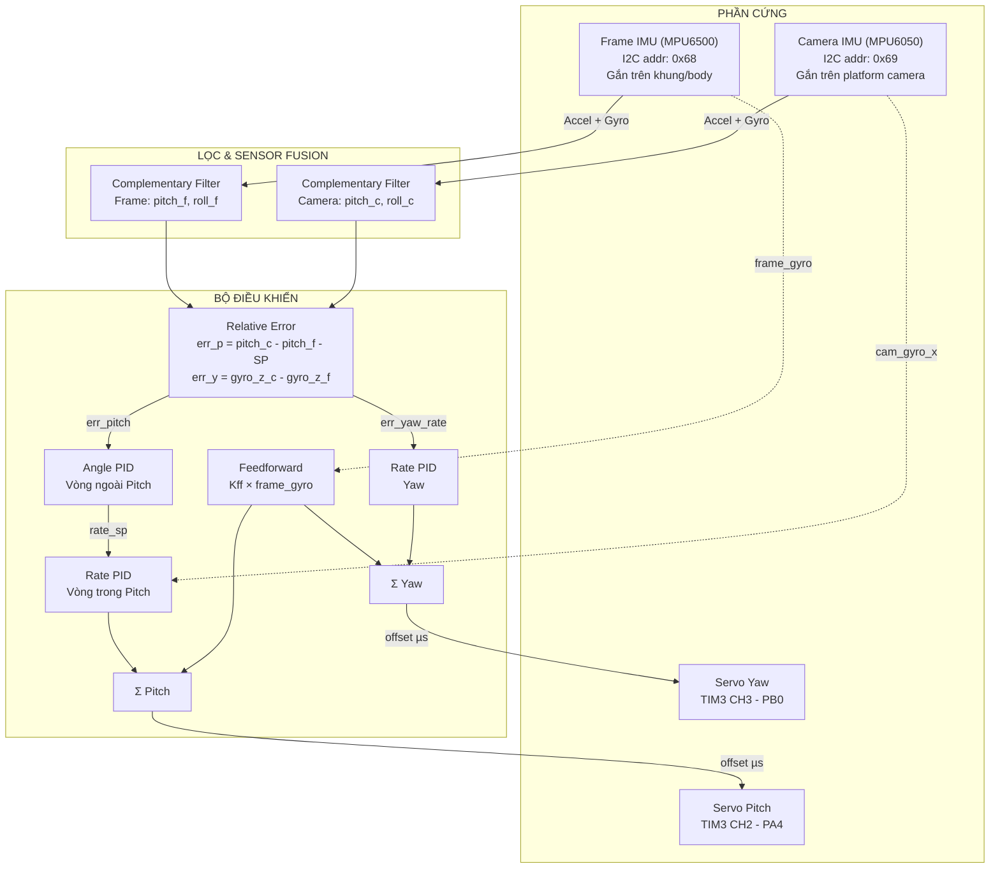

---

## 2. Tại sao dùng 2 IMU?

### Với 1 IMU (trên camera) — Phương pháp cũ
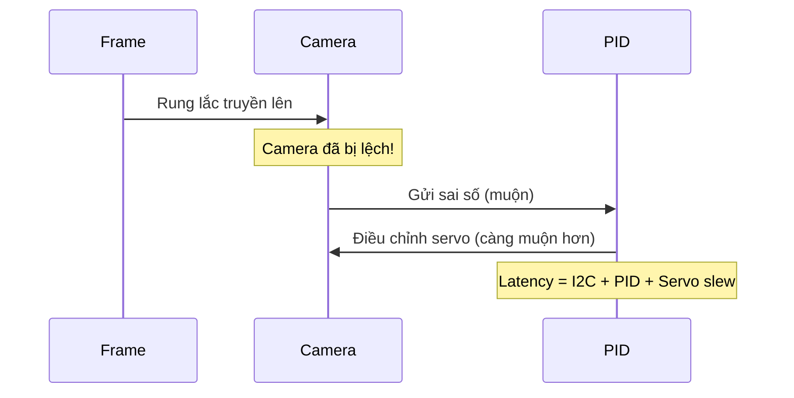

**Nhược điểm:** PID phải **đợi camera bị lệch** mới biết để phản ứng → luôn chậm 1 bước.

### Với 2 IMU — Phương pháp hiện tại
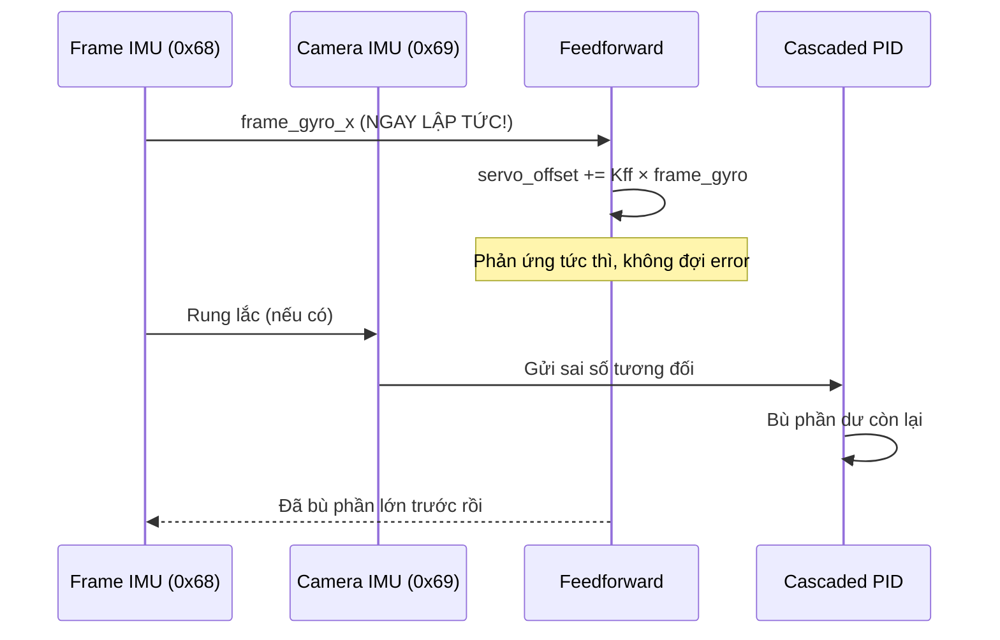

**Ưu điểm:** Feedforward từ Frame IMU bù **trước** khi camera bị lệch → hệ thống nhanh hơn và mượt hơn.

---

## 3. Bộ lọc Complementary Filter

### Vấn đề với từng cảm biến đơn lẻ

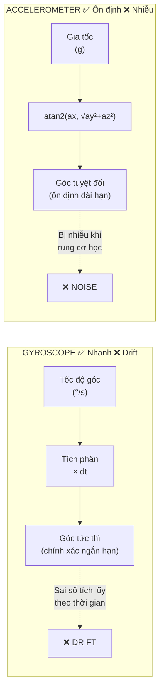

### Công thức Complementary Filter

```
angle[t] = α × (angle[t-1] + gyro × dt)  +  (1 - α) × accel_angle[t]
            \_______________________/         \_____________________/
               Phần High-Pass                    Phần Low-Pass
               (tin Gyro, phản ứng nhanh)       (tin Accel, chống drift)
```

### Flowchart `CompFilter_Update()`

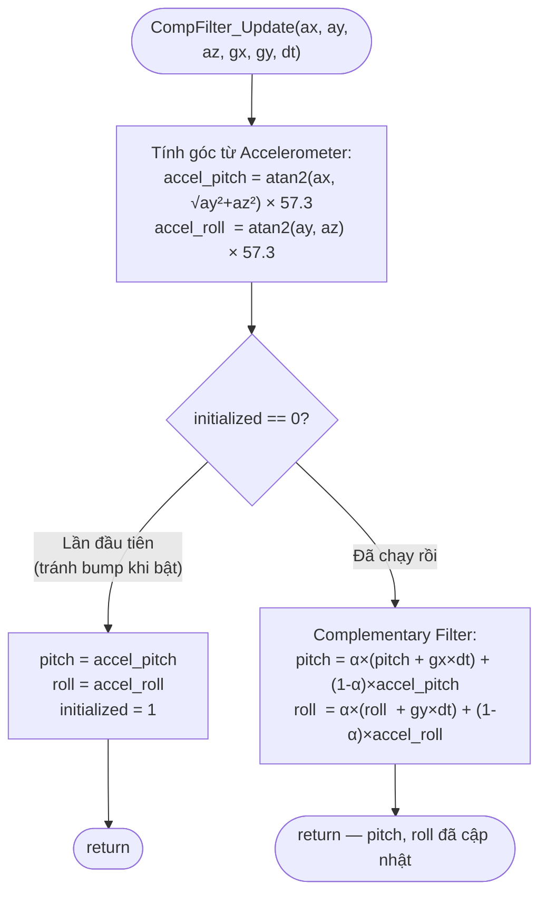

> **Giá trị α = 0.98** được dùng trong project:
> - Time constant: τ = α / ((1-α) × f) = 0.98 / (0.02 × 500Hz) ≈ **0.098 giây**
> - Nghĩa là drift của gyro được Accel bù lại sau ~0.1 giây

---

## 4. Relative Error — Sai số tương đối

### Tại sao dùng sai số tương đối thay vì sai số tuyệt đối?

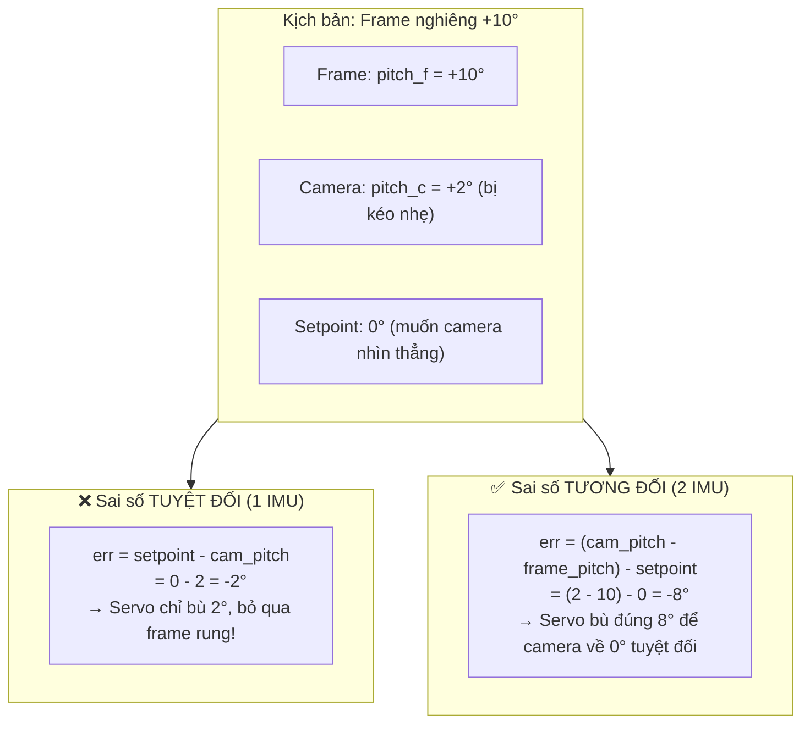

### Công thức tính Error trong code

```c
// Pitch: dùng góc tuyệt đối từ Complementary Filter
err_pitch = (cf_camera.pitch - cf_frame.pitch) - pitch_setpoint

// Yaw: dùng gyro rate (không có accel reference cho trục Z)
err_yaw = (cam_gyro_z - frame_gyro_z) - yaw_rate_setpoint
```

> **Lưu ý Yaw:** Không thể tính góc Yaw từ Accelerometer (trọng lực thẳng đứng, không có tham chiếu ngang). Vì vậy Yaw chỉ dùng **Rate PID** (lock tốc độ quay = 0).

---

## 5. Feedforward Control

### Nguyên lý

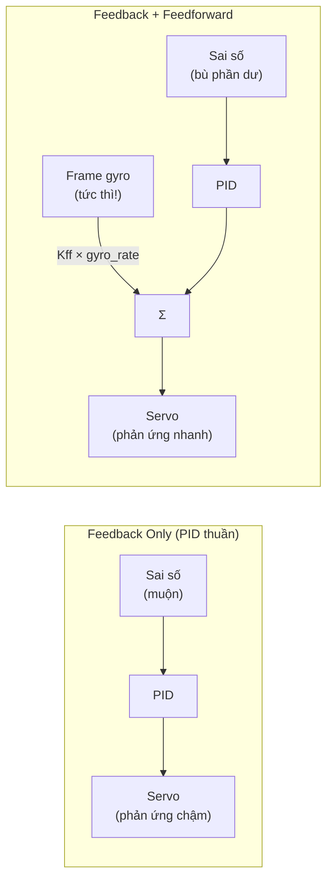

### Tại sao dùng Gyro Rate cho Feedforward thay vì Angle?

| | Gyro Rate | Angle (từ CF) |
|---|---|---|
| **Độ trễ** | Tức thì (0 trễ) | ~0.1s (time constant của CF) |
| **Drift** | Không drift ngắn hạn | Không drift (CF đã bù) |
| **Phù hợp FF?** | ✅ Tốt nhất | ❌ Có trễ |

---

## 6. Cascaded PID — Trục Pitch

Trục Pitch dùng **2 vòng PID lồng nhau** (Cascaded) để đạt phản ứng mượt và chính xác hơn 1 vòng PID đơn.

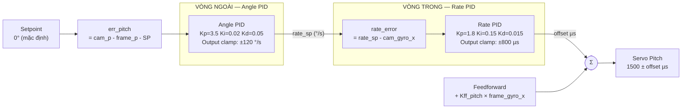

### Lý do dùng Cascaded thay vì 1 PID đơn

| | 1 PID đơn | Cascaded PID |
|---|---|---|
| Input → Output | Angle → Servo µs | Angle → Rate → Servo µs |
| **Ổn định** | Khó tuning, dễ dao động | Dễ tuning từng vòng riêng |
| **Phản ứng** | Có thể overshoot góc | Rate PID giới hạn tốc độ servo |
| **Chống nhiễu** | Kém | Tốt hơn — Rate feedback triệt nhiễu cơ học |

### Công thức PID rời rạc (triển khai trong `pid.c`)

```
error[k]   = setpoint - measurement

P = Kp × error[k]
I = I_prev + Ki × error[k] × dt        ← anti-windup: clamp I
D = Kd × (error[k] - error[k-1]) / dt  ← lọc EMA: D_filt = α×D_filt + (1-α)×D

output = P + I + D_filt                 ← clamp output_min..output_max
```

---

## 7. Rate PID — Trục Yaw

Yaw chỉ dùng **1 vòng Rate PID** (không có Angle PID) vì:
- Không có tham chiếu góc Yaw tuyệt đối từ gia tốc kế
- Mục tiêu: **lock yaw rate = 0** (kháng lại xoay ngang)

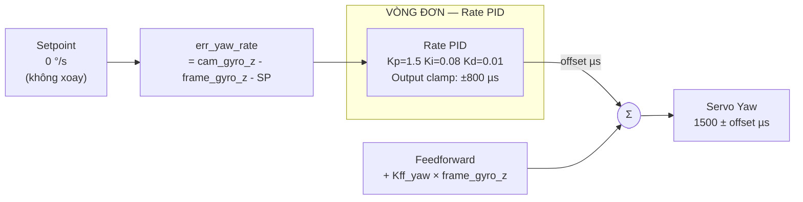

---

## 8. Servo Output Mapping

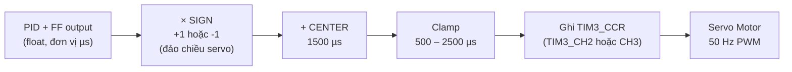

### Bảng ánh xạ góc → pulse width

| Góc | Pulse Width | CCR Value |
|---|---|---|
| -90° (cực tiểu) | 500 µs | 500 |
| 0° (trung tâm) | 1500 µs | 1500 |
| +90° (cực đại) | 2500 µs | 2500 |

> **Ghi chú:** Nếu servo quay ngược chiều, đặt `GIMBAL_SERVO_PITCH_SIGN = -1.0f` trong `gimbal_control.h`

---

## 9. Vòng lặp 500 Hz — Cơ chế Flag-based

### Tại sao không gọi thẳng từ TIM6 ISR?

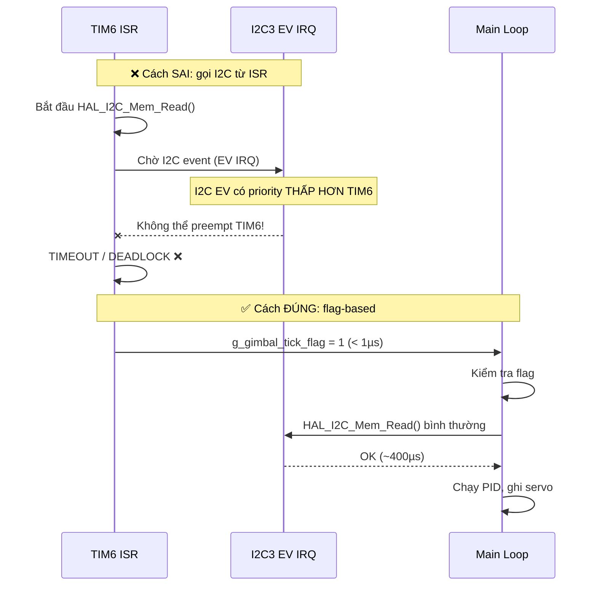

### Flowchart cơ chế Flag

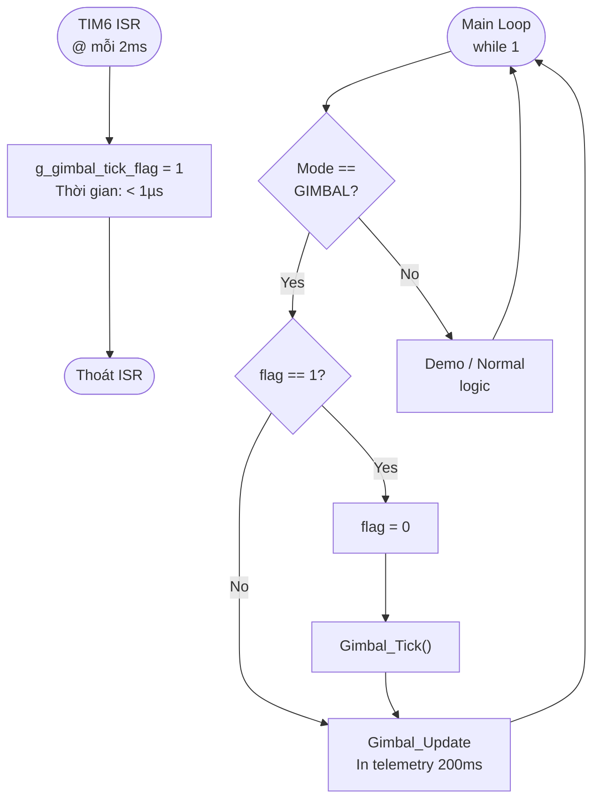

---

## 10. Luồng xử lý tổng thể

Đây là flowchart chi tiết của **hàm `Gimbal_Tick()`** — tim mạch của toàn bộ hệ thống:

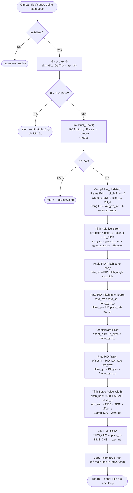

---

## 11. Bảng thông số mặc định

### Complementary Filter

| Tham số | Giá trị | Ý nghĩa |
|---|---|---|
| α (alpha) | 0.98 | 98% Gyro + 2% Accel |
| Time constant | ~0.098s | Drift bù sau ~100ms |
| Sample rate | 500 Hz | dt = 2ms |
| DLPF | 42 Hz BW | Lọc rung cơ học > 42Hz |

### PID Gains (điểm khởi đầu, cần tuning thực tế)

| Controller | Kp | Ki | Kd | Output Range |
|---|---|---|---|---|
| Pitch Angle (outer) | 3.5 | 0.02 | 0.05 | ±120 °/s |
| Pitch Rate (inner) | 1.8 | 0.15 | 0.015 | ±800 µs |
| Yaw Rate | 1.5 | 0.08 | 0.01 | ±800 µs |

### Anti-windup & Derivative Filter

| Tham số | Giá trị |
|---|---|
| Integral limit (Angle PID) | ±40 |
| Integral limit (Rate PID) | ±80 |
| D-term EMA filter (Angle) | α = 0.15 |
| D-term EMA filter (Rate) | α = 0.12 |

---

## 12. Hướng dẫn Tuning PID

### Quy trình tuning từng bước

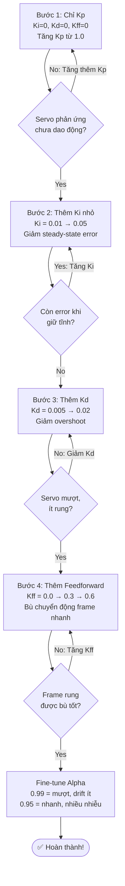

### CLI Commands để tuning (qua USB CDC Terminal)

```
p Kp Ki Kd    → Pitch Angle PID   ví dụ: p 3.5 0.02 0.05
P Kp Ki Kd    → Pitch Rate PID    ví dụ: P 1.8 0.15 0.015
y Kp Ki Kd    → Yaw Rate PID      ví dụ: y 1.5 0.08 0.01
f kff_p kff_y → Feedforward       ví dụ: f 0.4 0.3
a alpha       → Filter alpha      ví dụ: a 0.97
s deg         → Pitch setpoint    ví dụ: s -5.0
r             → Reset PIDs (xóa integral)
d             → Dump thông số hiện tại
```

### Dấu hiệu nhận biết vấn đề

| Triệu chứng | Nguyên nhân | Cách sửa |
|---|---|---|
| Servo rung liên tục | Kp quá cao | Giảm Kp |
| Camera không giữ thẳng | Kp quá thấp hoặc Ki=0 | Tăng Kp, thêm Ki |
| Servo giật khi frame rung | Kff quá cao | Giảm Kff |
| Camera lắc sau khi bị chạm | Kd thiếu | Tăng Kd nhẹ |
| Góc bị drift theo thời gian | alpha quá cao | Giảm alpha (0.97–0.98) |

---

*Tài liệu được tạo tự động từ source code — Last updated: 2026-05-20 (v3.0)*
